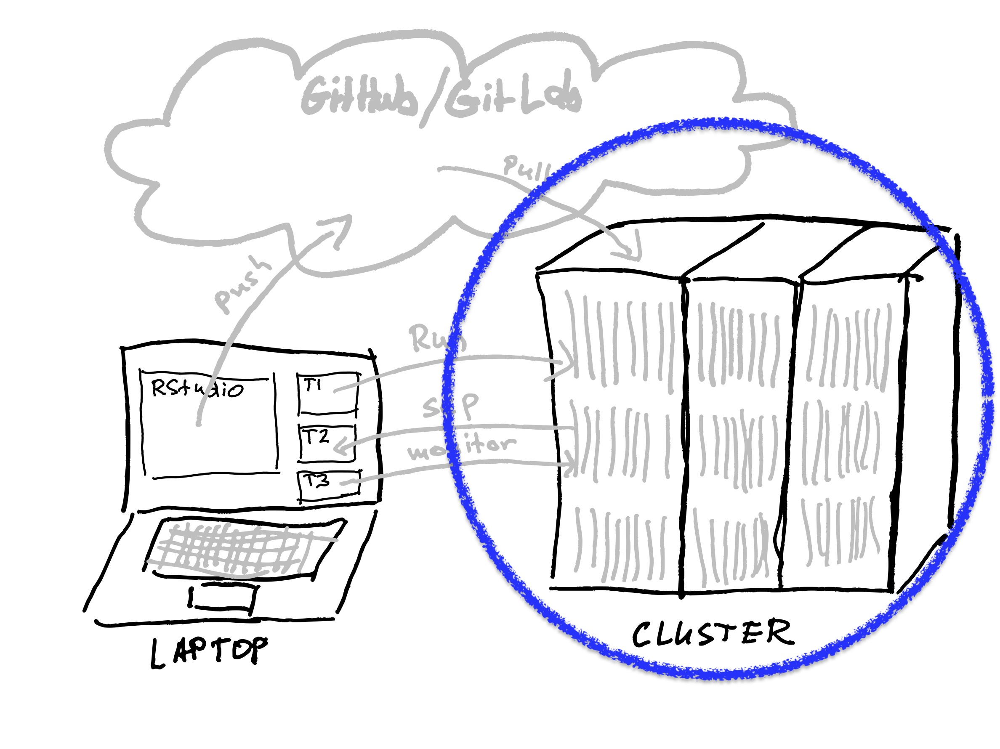

```{r setup, include=FALSE}
options(htmltools.dir.version = FALSE)
xaringanExtra::use_xaringan_extra(c("tile_view", "animate_css", "tachyons"))
hook_source <- knitr::knit_hooks$get('source')
knitr::knit_hooks$set(source = function(x, options) {
  x <- stringr::str_replace(x, "^[[:blank:]]?([^*].+?)[[:blank:]]*#<<[[:blank:]]*$", "*\\1")
  hook_source(x, options)
})
```
# Get this presentation: 
`git clone https://github.com/RBigData/R4HPC.git`

* Open `R4HPC_Part1.html` in your web browser  
* `?` toggles help  
<br>

<br><br><br>

The first hands-on session will get this presentation
<br><br><br><br><br><br><br><br>

---
# Using R on HPC Clusters Workshop

* A basic workflow for how to use R on an HPC cluster

* Speed up R scripts with parallel computing concepts

* Many packages in R offer parallel computing abstractions, yet they use a much smaller set of underlying approaches: 

   * multithreading in compiled code, the unix fork, and MPI

* We take a narrow path to focus on the direct approaches


#### Objectives 

* Learn a workflow to edit R code on your laptop and run it on an HPC cluster

* Learn how to use multicore and distributed parallel concepts in R on an HPC cluster system

???
* The workflow is half the battle to manage frustration of new users
* HPC cluster has several parallel resources used simulatneously
* On a laptop, often one choice among approaches is made
* Many abstractions are a layer above the basics
   * foreach, dopar, futures
   * Understanding basics helps understanding the abstractions 
   * Add another layer to a complex situation - harder debug
   * Basics are closer to HPC community (largely C and C++) terminology
      * Helps understanding HPC language

* Some of the exercises can be done on a laptop but miss the important workflow socialization

---

## <mark>Section 1:</mark> **Environment and Workflow**
## Section 2: Parallel Hardware and Software Overview
## Section 3: Shared Memory Tools
## Section 4: Distributed Memory Tools
---
## Working with a remote cluster using R

```{r echo=FALSE, out.height=500, fig.retina=1}
knitr::include_graphics("pics/01-intro/Workflow.jpg")
```
???

* Please excuse my art
* Conveys what's needed but could be a LOT better
   * If someone has better skills, I'd be very grateful for a better pic
   
* A workflow that I've settled-on last few years
   * manages frustration with interactive - batch transition
   * I see it mostly from a macOS perspective but works in Windows too
   
---
background-image: url(pics/01-intro//Workflow.jpg)
background-position: top right
background-size: 20%

### Laptop RStudio
* Familiar custom editing environment (Windows, Mac, Unix)
* Interactive Syntax checking

### GitHub/GitLab
* Portability to remote computing
* Version control
* Collaboration

### Cluster unix
* Same environment for all
* Batch job submission

#### Advanced: interactive multinode development and debugging
* Available now (packages: launchr, pbdCS, pbdRPC, remoter)
* Needs further development (particularly launchr) and standardization

???
* Portability - in your basement or on another continent - remorely in EU
* RStudio on cluster:
  * Installs difficult: legacy OS on HPC
  * Bandwidth
  * Minor RStudio differences due to OS
---
background-image: url(pics/01-intro//WorkflowRunning.jpg)
background-position: top right
background-size: 20%

## Running Distributed on a Cluster

```{r echo=FALSE, out.height=500, fig.retina=1}
knitr::include_graphics("pics/01-intro/BatchRonCluster.jpg")
```
???
Ultimate goal of workshop
* Pic of cluster use with R: 32 R sessions collaborating on 8 nodes
   * Laptop - login node - resource script - multi R session collaboration
   * BIG data on parallel file system - not on laptop!
   * Can monitor a longer run with logins to compute nodes
   * Batch
---
background-image: url(pics/01-intro//WorkflowLaptop.jpg)
background-position: top right
background-size: 20%

### Software Needed on Laptop
* Mac
   * R, RStudio
   
   * terminal, git (in Xcode)
   
* Windows
   * R, RStudio
   
   * putty
   
   * git
   
   * WinSCP
---
background-image: url(pics/01-intro/WorkflowCluster.jpg)
background-position: top right
background-size: 20%

## Software on Cluster

* OpenBLAS
* FlexiBLAS
* OpenMPI
* HDF5 (for parallel I/O)
* R (>= 4.0)
* And various packages, including `RBigData/pbdMPI` (GitHub version)


#### R vs conda-R Deployment
* Direct R is preferred
* CRAN and Anaconda differ in package management philosophy
* Can end up with conflicts if mixing
* Adds a layer of complexity for the R user

???
* Complexity without obvious benefit if using current CRAN packages
---
background-image: url(pics/01-intro/WorkflowGit.jpg)
background-position: top left
background-size: 20%

# <font size="+2">2</font> $\qquad$ GitHub and git (laptop to cluster)

.w80.pull-left[
```{r echo=FALSE, out.height=400, fig.retina=1}
knitr::include_graphics("pics/01-intro/Git_operations.svg")
```
<font size="-6">*By Daniel Kinzler - Own work, CC BY 3.0, https://commons.wikimedia.org/w/index.php?curid=25223536</font>
]
.w20.pull-right[
<br>
```{r echo=FALSE, out.height=80, fig.retina=1}

```
3
<br><br><br><br><br><br><br><br><br><br>

```{r echo=FALSE, out.height=80, fig.retina=1}
knitr::include_graphics("pics/01-intro/WorkflowLaptop.jpg")
```
1
]
---
background-image: url(pics/01-intro/WorkflowPushPull.jpg)
background-position: top right
background-size: 20%

# Making **git** easy: set ssh keys

* Private and Public key pairs for Client and Server

  * Git repository (GitHub, GigLab) is the server
  * Your laptop or remote cluster are clients

* Each client has own key-pair

  * Private key stays on the client
  * Public key is copied to the server

* Works like a single-use password generator and authentication

  * Client contacts server
  * Server sends a random string encrypted by client's public key
  * Client decrypts with own private key and sends to server
  * Server verifies agreement and opens secure connection
  
---
background-image: url(pics/01-intro//WorkflowCluster.jpg)
background-position: top right
background-size: 20%

# Clusters are Linux systems
* Linux is one of many descendants of original Unix. MacOS is another.

* Like all file systems, Linux files are organized as a tree.

* When in a terminal, you are talking to a *shell* program (*bash* is most common)

   * Each command can have a list of *options* and a list of *arguments*
   * *Standard input* and *standard output* of a command is the terminal but can be redirected
   * **<**, **<<**, **>**, **>>** redirect standard input and output
   * *command1* **|** *command2* pipes standard output1 to standard input2
   * Commands are looked up in directories listed in your PATH variable (try "echo $PATH")
   * $ means substitute variable value
   * *export* lists (or sets) shell variables and their values

* There are many resources on the web to learn Linux basics

???
* A few unix things to explain scripts you will see

---
background-image: url(pics/01-intro/WorkflowCluster.jpg)
background-position: top right
background-size: 20%

## Job Submission on Cluster

* Command line submission
* Shell script submission (preferred)

.pull-left[
#### SLURM
<mark>sbatch  *your-shell-script.sh* </mark>

<mark>squeue  -u *uid*</mark>

<mark>scancel  *jobnumber*</mark>
]
.pull-right[
#### PBS
<mark>qsub   *your-shell-script.sh* 

<mark>qstat -u *uid*

<mark>qdel  *jobname*</mark>
]  
<br>
* **module** to set software environment (PATH)
  * <mark>*module list*</mark> - list what is loaded
  * <mark>*module avail*</mark> - list what is available
  * <mark>*module load r*</mark>
  
???
* More explanation for scripts you will see
  
---
## Hands-on Session 1 - Fork and clone your R4HPC
* Fork R4HPC to your GitHub account
   * Login to GitHub (or GitLab)
   * Navigate to RBigData/R4HPC repository
   * GitHub: Fork button near top-right and copy forked repo url
   * GitLab: See https://docs.gitlab.com/ee/api/import.html
* Clone to New Project in RStudio
* Open Terminal window (ssh or putty)
* Login to cluster
* clone your R4HPC (git clone ...)
* You are ready for the development loop: 
   * edit -> commit -> push -> pull -> run -> examine output
   
.pull-left[
```{r echo=FALSE, out.height=250, fig.retina=1}
knitr::include_graphics("pics/01-intro/Workflow.jpg")
```
]
.pull-right[
```{r echo=FALSE, out.height=250, fig.retina=1}
knitr::include_graphics("pics/01-intro/BatchRonCluster.jpg")
```
]

---
## Hands-on Session 1 - On Login Node
* Below, replace `MACHINE` with your cluster name
* Go to `R4HPC/code_0` directory and run
   * `./packages_MACHINE.sh` to install all R packages that will be used

* Go to `R$HPC/code_1` directory and run
   * `sbatch hello_MACHINE_slurm.sh` to run a script that illustrates a basic two-level parallelism
   * We will return to this script throughout the workshop as we learn its components

* Examine output in `hello.e` and `hello.o` and notice that:
  * 4 nodes are involved
  * 4 R sessions were running on each node for a total of 16
  * Each R session ran `mclapply` on several cores
  * All `mclapply` process id's are reported
  * The code figured out how many cores in total
  * Only one R session wrote the output

???
#SBATCH -A your-group-account

`group` will show what groups you are in

