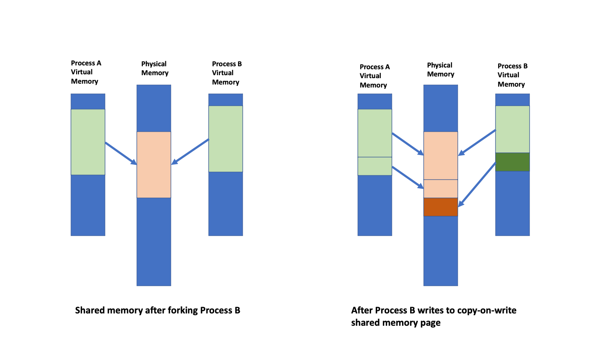

```{r setup, include=FALSE}
options(htmltools.dir.version = FALSE)
xaringanExtra::use_xaringan_extra(c("tile_view", "animate_css", "tachyons"))
hook_source <- knitr::knit_hooks$get('source')
knitr::knit_hooks$set(source = function(x, options) {
  x <- stringr::str_replace(x, "^[[:blank:]]?([^*].+?)[[:blank:]]*#<<[[:blank:]]*$", "*\\1")
  hook_source(x, options)
})
```
# Get this presentation: 
`git clone https://github.com/RBigData/R4HPC.git`

* Open `R4HPC_Part1.html` in your web browser  
* `?` toggles help  
<br>

Slack workspace link for this workshop was emailed to you. 
<br><br><br>

<small>
*Many thanks to my colleagues and former colleagues who contributed to the software and ideas presented here. See the RBigData Organization on Github: https://github.com/RBigData. Also, many thanks to all R developers of packages used in this presentation.*

*This manuscript has been authored by UT-Battelle, LLC under Contract No. DE-AC05-00OR22725 with the U.S. Department of Energy. The United States Government retains and the publisher, by accepting the article for publication, acknowledges that the United States Government retains a non-exclusive, paid-up, irrevocable, world-wide license to publish or reproduce the published form of this manuscript, or allow others to do so, for United States Government purposes. The Department of Energy will provide public access to these results of federally sponsored research in accordance with the DOE Public Access Plan (http://energy.gov/downloads/doe-public-access-plan).*</small>

???
The first hands-on session will do this also
<br><br><br><br><br><br><br><br>

Of course, any mistakes are mine alone!!

---
# Using R on HPC Clusters Webinar

* A basic workflow for how to use R on an HPC cluster
* Speed up R scripts with parallel computing concepts
* Many packages in R offer parallel computing abstractions, yet they use a much smaller set of underlying approaches: 
   * multithreading in compiled code, the unix fork, and MPI
* We take a narrow path to focus on the direct approaches
* Targeted for current users of OLCF, CADES, ALCF and NERSC
* Others are welcome to the lecture portions but will not be able to participate in all of the hands-on activities

#### Objectives 

* Learn a workflow to edit R code on your laptop and run it on an HPC cluster

* Learn how to use multicore and distributed parallel concepts in R on an HPC cluster system

???
* The workflow is half the battle to manage frustration of new users
* HPC cluster has several parallel resources used simulatneously
* On a laptop, often one choice among approaches is made
* Many abstractions are a layer above the basics
   * foreach, dopar, futures
   * Understanding basics helps understanding the abstractions 
   * Add another layer to a complex situation - harder debug
   * Basics are closer to HPC community (largely C and C++) terminology
      * Helps understanding HPC language

* Some of the exercises can be done on a laptop but miss the important workflow socialization

---
background-image: url(pics/01-intro/WorkflowCluster.jpg)
background-position: top right
background-size: 20%

## The Clusters

ORNL OLCF Andes
* 704 nodes, each with two 16-core 3.0 GHz AMD EPYC processors

ORNL CADES SHPC Condos
* ~650 nodes, a mix of x86_64 processors with 32 to 128 cores
* New LMOD software stack (see https://docs.cades.ornl.gov/#condos/software/bash-env/#new-software-stack)

LBL NERSC Perlmutter 
* 3,072 CPU-only nodes, AMD EPYC Milan, each with 64 cores
* 1,536 GPU-accelerated nodes, AMD EPYC Milan + 4 NVIDIA A100 GPU

ANL ACLF Polaris
* 560 nodes, each with AMD EPYC Milan (32 cores)  + 4 NVIDIA A100 GPU

---
# Access to HPC Clusters

* DOE OLCF https://docs.olcf.ornl.gov/accounts/accounts_and_projects.html
* DOE ORNL CADES https://cades.ornl.gov/
* DOE ALCF https://www.alcf.anl.gov/support-center/account-and-project-management/allocations

* DOE NERSC https://www.nersc.gov/users/accounts/allocations/
* NSF XSEDE to ACCESS https://www.xsede.org/

* A cluster at your institution  

* International:
   * EU PRACE https://prace-ri.eu/hpc-access/ (for example IT4I.cz https://www.it4i.cz/en/for-users/computing-resources-allocation) 
   * UK, Switzerland, Japan, and many others have similar programs

 
---

## <mark>Section I:</mark> **Environment and Workflow**
## Section II: Parallel Hardware and Software Overview
## Section III: Shared Memory Tools
## Section IV: Distributed Memory Tools
---
## Working with a remote cluster using R

```{r echo=FALSE, out.height=500}
knitr::include_graphics("pics/01-intro/Workflow.jpg")
```
???

* Please excuse my art
* Conveys what's needed but could be a LOT better
   * If someone has better skills, I'd be very grateful for a better pic
   
* A workflow that I've settled-on last few years
   * manages frustration with interactive - batch transition
   * I see it mostly from a macOS perspective but works in Windows too
   
---
background-image: url(pics/01-intro//Workflow.jpg)
background-position: top right
background-size: 20%

### Laptop RStudio (Posit in October, 2022)
* Familiar custom editing environment (Windows, Mac, Unix)
* Interactive Syntax checking

### GitHub/GitLab
* Portability to remote computing
* Version control
* Collaboration

### Cluster unix
* Same environment for all
* Batch job submission

#### Advanced: interactive multinode development and debugging
* Available now (packages: launchr, pbdCS, pbdRPC, remoter)
* Needs further development (particularly launchr) and standardization

???
* Portability - in your basement or on another continent - remorely in EU
* RStudio on cluster:
  * Installs difficult: legacy OS on HPC
  * Bandwidth
  * Minor RStudio differences due to OS
---
background-image: url(pics/01-intro//WorkflowRunning.jpg)
background-position: top right
background-size: 20%

## Running Distributed on a Cluster

```{r echo=FALSE, out.height=500}
knitr::include_graphics("pics/01-intro/BatchRonCluster.jpg")
```
???
Ultimate goal of workshop
* Pic of cluster use with R: 32 R sessions collaborating on 8 nodes
   * Laptop - login node - resource script - multi R session collaboration
   * BIG data on parallel file system - not on laptop!
   * Can monitor a longer run with logins to compute nodes
   * Batch
---
background-image: url(pics/01-intro//WorkflowLaptop.jpg)
background-position: top right
background-size: 20%

### Software Needed on Laptop
* Mac
   * R, RStudio
   
   * terminal, git (in Xcode)
   
* Windows
   * R, RStudio
   
   * putty
   
   * git
   
   * WinSCP
---
background-image: url(pics/01-intro/WorkflowCluster.jpg)
background-position: top right
background-size: 20%

## Software on Cluster

* OpenBLAS
* FlexiBLAS
* OpenMPI
* HDF5 (for parallel I/O)
* R (>= 4.0)
* And various packages, including `RBigData/pbdMPI` (GitHub version)


#### R vs conda-R Deployment
* Direct R is preferred
* CRAN and Anaconda differ in package management philosophy
* Can end up with conflicts if mixing
* Adds a layer of complexity for the R user

???
* Complexity without obvious benefit if using current CRAN packages
---
background-image: url(pics/01-intro/WorkflowGit.jpg)
background-position: top left
background-size: 20%

# <font size="+2">2</font> $\qquad$ GitHub and git (laptop to cluster)

.w80.pull-left[
```{r echo=FALSE, out.height=400}
knitr::include_graphics("pics/01-intro/Git_operations.svg")
```
<font size="-6">*By Daniel Kinzler - Own work, CC BY 3.0, https://commons.wikimedia.org/w/index.php?curid=25223536</font>
]
.w20.pull-right[
<br>
```{r echo=FALSE, out.height=80}
knitr::include_graphics("pics/01-intro/WorkflowCluster.jpg")
```
3
<br><br><br><br><br><br><br><br><br><br>

```{r echo=FALSE, out.height=80}
knitr::include_graphics("pics/01-intro/WorkflowLaptop.jpg")
```
1
]
---
background-image: url(pics/01-intro/WorkflowPushPull.jpg)
background-position: top right
background-size: 20%

# Making **git** easy: set ssh keys

* Private and Public key pairs for Client and Server

  * Git repository (GitHub, GigLab) is the server
  * Your laptop or remote cluster are clients

* Each client has own key-pair

  * Private key stays on the client
  * Public key is copied to the server

* Works like a single-use password generator and authentication

  * Client contacts server
  * Server sends a random string encrypted by client's public key
  * Client decrypts with own private key and sends to server
  * Server verifies agreement and opens secure connection
  
---
background-image: url(pics/01-intro//WorkflowCluster.jpg)
background-position: top right
background-size: 20%

# Clusters are Linux systems
* Linux is one of many descendants of original Unix. MacOS is another.

* Like all file systems, Linux files are organized as a tree.

* When in a terminal, you are talking to a *shell* program (*bash* is most common)

   * Each command can have a list of *options* and a list of *arguments*
   * *Standard input* and *standard output* of a command is the terminal but can be redirected
   * **<**, **<<**, **>**, **>>** redirect standard input and output
   * *command1* **|** *command2* pipes standard output1 to standard input2
   * Commands are looked up in directories listed in your PATH variable (try "echo $PATH")
   * $ means substitute variable value
   * *export* lists (or sets) shell variables and their values

* There are many resources on the web to learn Linux basics

???
* A few unix things to explain scripts you will see

---
background-image: url(pics/01-intro/WorkflowCluster.jpg)
background-position: top right
background-size: 20%

## Job Submission on Cluster

* Command line submission
* Shell script submission (preferred)

.pull-left[
#### Slurm (Andes, CADES, Perlmutter)
<mark>sbatch  *your-shell-script.sh* </mark>

<mark>squeue  -u *uid*</mark>

<mark>scancel  *jobnumber*</mark>
]
.pull-right[
#### Cobalt - PBS (Polaris)
<mark>qsub   *your-shell-script.sh* 

<mark>qstat -u *uid*

<mark>qdel  *jobname*</mark>
]  
<br>
* **module** to set software environment (PATH)
  * <mark>*module list*</mark> - list what is loaded
  * <mark>*module avail*</mark> - list what is available
  * <mark>*module load r*</mark>
  
???
* More explanation for scripts you will see
  
---
## Hands-on Session 1 - Fork and clone your R4HPC
* Fork R4HPC to your GitHub account
   * Login to GitHub (or GitLab)
   * Navigate to RBigData/R4HPC repository
   * GitHub: Fork button near top-right and copy forked repo url
   * GitLab: See https://docs.gitlab.com/ee/api/import.html
* Clone to New Project in RStudio
* Open Terminal window (ssh or putty)
* Login to cluster
* clone your R4HPC (git clone ...)
* You are ready for the development loop: 
   * edit -> commit -> push -> pull -> run -> examine output
   
.pull-left[
```{r echo=FALSE, out.height=250}
knitr::include_graphics("pics/01-intro/Workflow.jpg")
```
]
.pull-right[
```{r echo=FALSE, out.height=250}
knitr::include_graphics("pics/01-intro/BatchRonCluster.jpg")
```
]

---
## Hands-on Session 1 - On Login Node
* Below, replace `MACHINE` with your cluster name (andes, cades are available)
* Go to `R4HPC/code_0` directory and run
   * `./packages_MACHINE.sh` to install all R packages that will be used

* Go to `R$HPC/code_1` directory and run
   * `sbatch hello_MACHINE_slurm.sh` to run a script that illustrates a basic two-level parallelism
   * We will return to this script throughout the workshop as we learn its components

* Examine output in `hello.e` and `hello.o` and notice that:
  * 4 nodes are involved
  * 4 R sessions were running on each node for a total of 16
  * Each R session ran `mclapply` on several cores
  * All `mclapply` process id's are reported
  * The code figured out how many cores in total
  * Only one R session wrote the output

???
#SBATCH -A your-group-account

`group` will show what groups you are in

---

## Section I: Environment and Workflow
## <mark>Section II:</mark> **Parallel Hardware and Software Overview**
## Section III: Shared Memory Tools
## Section IV: Distributed Memory Tools

---
background-image: url(pics/Mangalore/ParallelHardware/Slide7.png)
background-position: bottom
background-size: 90%

# Three Basic Concepts in Hardware

???
# GPU - NVIDIA
# MIC - Intel KNL - ARM

* Manycore chip with memory on the chip instead of separate memory boards: https://www.youtube.com/watch?v=eXhlDt2SD8o
  * A manycore that can act as a GPU
  * Multocores are MIMD and can run anything
  * GPU are SIMD and more limited
---
background-image: url(pics/Mangalore/ParallelHardware/Slide1.png)
background-position: bottom
background-size: 90%

# Three Basic Concepts in Hardware

???
# GPU - NVIDIA
# MIC - Intel KNL - ARM

* Manycore chip with memory on the chip instead of separate memory boards: https://www.youtube.com/watch?v=eXhlDt2SD8o
  * A manycore that can act as a GPU
  * Multocores are MIMD and can run anything
  * GPU are SIMD and more limited
---
background-image: url(pics/Mangalore/ParallelHardware/Slide2.png)
background-position: bottom
background-size: 90%

???
Graphics
---
background-image: url(pics/Mangalore/ParallelHardware/Slide3.png)
background-position: bottom
background-size: 90%

???
GPU - NVIDIA
MIC - Intel KNL
---
background-image: url(pics/Mangalore/ParallelHardware/Slide4.png)
background-position: bottom
background-size: 90%

---
background-image: url(pics/Mangalore/ParallelHardware/Slide5.png)
background-position: bottom
background-size: 90%

---
background-image: url(pics/Mangalore/ParallelHardware/Slide6.png)
background-position: bottom
background-size: 90%

---
background-image: url(pics/Mangalore/ParallelSoftware/Slide2.png)
background-position: bottom
background-size: 90%

# Native Programming Mindset

---
background-image: url(pics/Mangalore/ParallelSoftware/Slide3.png)
background-position: bottom
background-size: 90%

# Native Programming Models and Tools

---
background-image: url(pics/Mangalore/ParallelSoftware/Slide4.png)
background-position: bottom
background-size: 90%

# 35+ Years of Practical Parallel Computing

---
background-image: url(pics/Mangalore/ParallelSoftware/Slide5.png)
background-position: bottom
background-size: 90%

# Last 15+ years of Advances

---
background-image: url(pics/Mangalore/ParallelSoftware/Slide6.png)
background-position: bottom
background-size: 90%

## Distributed Programming Works in Shared Memory

---
background-image: url(pics/Mangalore/ParallelSoftware/Slide7.png)
background-position: bottom
background-size: 90%

# R Interfaces to Low-Level Native Tools
---

## Section I: Environment and Workflow
## Section II: Parallel Hardware and Software Overview
## <mark>Section III:</mark> **Shared Memory Tools**
## Section IV: Distributed Memory Tools
---
background-image: url(pics/Mangalore/ParallelSoftware/Slide7shared.jpg)
background-position: bottom
background-size: 90%

# Working with a single node

---
background-image: url(pics/Mangalore/ParallelSoftware/Slide7fork.jpg)
background-position: bottom
background-size: 90%

# fork via mclapply
???
* we begin with `paralel`'s multicore parts
* continue with Foreign language via libraries (OpenBLAS, nvBLAS)
* go to SPMD MPI with collectives

* reverse of history - because we are used to a laptop 
* Distributed - some things are recomputed rather than communicated


---
background-image: url(pics/Mangalore/ParallelSoftware/Slide7fork.jpg)
background-position: top right
background-size: 20%

# Unix `fork`
* A memory efficient parallelism on shared memory devices  

* Copy-on-write: copy page if forked process tries to write  

* R: **parallel** package `mclapply` and friends  
   * Use for numerical sections only
   * Avoid GUI, I/O, and graphics sections
* Convenient for data (not modified)

* Convenient for functional languages like R

* Careful with nested parallelism
  * OpenBLAS takes all cores by default
  * data.table switches to single threaded mode upon fork

.footnote[A deeper discussion of `fork` memory (if you have interest) on [YouTube](https://www.youtube.com/watch?v=8hVLcyBkSXY) by Chris Kanich (UIC)]

---
background-image: url(pics/Mangalore/ParallelSoftware/Slide7fork.jpg)
background-position: top right
background-size: 20%

# Copy-on-write

```{r echo=FALSE, out.height=500, fig.align='center'}

```
???
* All done with pointers
* Memory is in pages
* Processes not aware of each other or other's memory use
* OS is aware of memory use
* 16 forks write = 16 copies of memory

---
background-image: url(pics/Mangalore/ParallelSoftware/Slide7fork.jpg)
background-position: top right
background-size: 20%

# Mapping (Forked) Processes to Cores
* Operating system manages core affinity
* OS tasks compete and core switching occurs frequently
```{r echo=FALSE, fig.retina=1, fig.align='center'}

```
* Works extremely well unless very large new memory allocation is needed by each process
* Forking can be nested but be careful not to oversubscribe available cores
---
background-image: url(pics/Mangalore/ParallelSoftware/Slide7fork.jpg)
background-position: top right
background-size: 20%

# Parallel Drop-in replacements (almost) <br> for `lapply`, `mapply`, and `Map`
<mark>
`mclapply(X, FUN, ...,`
`         mc.preschedule = TRUE, mc.set.seed = TRUE,`
`         mc.silent = FALSE, mc.cores = getOption("mc.cores", 2L),`
`         mc.cleanup = TRUE, mc.allow.recursive = TRUE, affinity.list = NULL)`
</mark>

`mcmapply(FUN, ...,`
`         MoreArgs = NULL, SIMPLIFY = TRUE, USE.NAMES = TRUE,`
`         mc.preschedule = TRUE, mc.set.seed = TRUE,`
`         mc.silent = FALSE, mc.cores = getOption("mc.cores", 2L),`
`         mc.cleanup = TRUE, affinity.list = NULL)`

`mcMap(f, ...)`

---
## Hands-on Session 2 - Multicore Random Forest

* Go to `R4HPC/code_2` directory

* Look at the `rf_serial.R` and `rf_mc.R` codes

---
background-image: url(pics/Mangalore/ParallelSoftware/Slide7fork.jpg)
background-position: top right
background-size: 20%

## Hands-on Session 2 - Example Random forest Code
#### Letter recognition data ( $20\,000 \times 17$ )
```{r echo=FALSE, out.height=350, fig.align='center'}
knitr::include_graphics("pics/MC/ML_FreySlate1991.png")
```

.footnote[*Parallel Statistical Computing with R: An Illustration on Two Architectures [ 	arXiv:1709.01195](https://arxiv.org/abs/1709.01195)]
---
background-image: url(pics/Mangalore/ParallelSoftware/Slide7fork.jpg)
background-position: top right
background-size: 20%

## Hands-on Session 2 - Random Forest Classification

### Build many decision trees

### Each tree built from

* random subset of variables: subset of columns

* resampled (with replacement) data: same number of rows

### Use their majority votes to classify

---
### Hands-on Session 2 - `R4HPC/code_2/rf_serial.R`
```{r eval=FALSE, code = readLines("code_2/rf_serial.R")}
```

---
### Hands-on Session 2 - `R4HPC/code_2/rf_mc.R`
```{r eval=FALSE, code = readLines("code_2/rf_mc.R")}
```

---
## Hands-on Session 2 - Assignment

Time the random forest code `rf_mc.R` for 1 through 32 cores by modifying the `rf_MACHINE_slurm.sh` script.
---
background-image: url(pics/Mangalore/ParallelSoftware/Slide7libs.jpg)
background-position: bottom
background-size: 90%

# Libraries via compiled language interfaces

---
background-image: url(pics/Mangalore/ParallelSoftware/Slide7libs.jpg)
background-position: top right
background-size: 20%

# R-LAPACK-BLAS

* BLAS: Basic Linear Algebra Subroutines - A matrix multiplication library
  * `%*%`, `crossprod()`, `sweep()`, `scale()`, and many more

* LAPACK: dense and banded matrix decomposition and more
  * `svd()`, `La.svd()`, `prcomp()`, `princomp()`, `qr()`, `solve()`, `chol()`, `norm()`, and many more
  * But not `lm()`, careful with `qr(x, LAPACK = TRUE)`: column pivoting

* Implementations: OpenBLAS, Intel MKL, Nvidia nvBLAS, Apple vecLib, AMD BLIS, Arm Performance Libraries

* **FlexiBLAS**: A BLAS and LAPACK wrapper library with runtime exchangeable backends
   * Great for benchmarking implementations
   * Great for dynamic core assignment

???
* Optimizes algorithm to chip microarchitecture details 
   * memory hierarchies (L1 cache, L2 cache, etc.) and 
   * register vector length
   
* FlexiBLAS Standardization of API for BLAS core control
   * C, C++, R, Python/numpy, Julia

---

## Faster BLAS For Faster R on your Laptop (macOS)

```{r eval=FALSE}
## Default BLAS from Netlib
> x = matrix(rnorm(1e7), nrow = 1e4)
> system.time(crossprod(x))
   user  system elapsed 
  6.752   0.023   6.801 
```
```{r eval=FALSE}
## vecLib (4 cores)
> system.time(crossprod(x))
   user  system elapsed 
  0.420   0.003   0.078 
```
```{r eval=FALSE}
## OpenBLAS (4 cores)
> system.time(crossprod(x))
   user  system elapsed 
  0.457   0.028   0.075 
```
---
## Install FlexiBLAS For BLAS Control on macOS Laptop

* Install Xcode and command line tools
* Install Homebrew: https://brew.sh/
* In a terminal window:
  * `brew install cmake`
  * `brew install openblas`
* cmake needs to be told about OpenBLAS: 
     * `export CMAKE_PREFIX_PATH=/usr/local/opt/openblas:$CMAKE_PREFIX_PATH`
* Install FlexiBLAS: https://www.mpi-magdeburg.mpg.de/projects/flexiblas
  * See Install section in its README.md
* After installation, link to R (terminal window):
  * `ln -sf /usr/local/lib/libflexiblas.dylib /Library/Frameworks/R.framework/Resources/lib/libRblas.dylib`
* In R, `install.packages("flexiblas")` and test if it works:
  * `flexiblas_avail()`
  * `flexiblas_list()`

R can now swap OpenBLAS and APPLE vecLib dynamically. <br>
Dynamically control number of cores used in OpenBLAS. <br>
Control vecLib threads with VECLIB_MAXIMUM_THREADS before starting R.

???
Long Install

Eases transition to cluster if practiced on laptop

Brings more portability to parallel codes

---
## For faster R on your Windows laptop

Assessing R performance with optimized BLAS across three operating systems   [link](https://thomasmcrow.com/blog/2021-08-optimized-blas-in-r/)

<br>

Building R 4+ for Windows with OpenBLAS    [link](https://www.r-bloggers.com/2020/05/building-r-4-for-windows-with-openblas/)

---
background-image: url(pics/Mangalore/ParallelSoftware/Slide7libs.jpg)
background-position: top right
background-size: 20%

## Hands-on Session 3 - FlexiBLAS

`code_3/flexiblas_setup.R`
```{r eval=FALSE, code = readLines("code_3/flexiblas_setup.r", n = 19)}
```

.footnote[
[https://github.com/Enchufa2/r-flexiblas](https://github.com/Enchufa2/r-flexiblas)  
[https://cran.r-project.org/package=flexiblas](https://cran.r-project.org/package=flexiblas)
]
---
background-image: url(pics/Mangalore/ParallelSoftware/Slide7libs.jpg)
background-position: top right
background-size: 20%

# Hands-on Session 3 - FlexiBLAS

* Go to `code_3` directory
* Submit `flexiblas_MACHINE_slurm.sh`
* Examine output to notice:
  * Maximum cores can be slow
  * Optimal cores can depend on matrix size and shape

---
# Acknowledgments

*This research used resources of the Oak Ridge Leadership Computing Facility, which is a DOE Office of Science User Facility supported under Contract DE-AC05-00OR22725.*

*This research used resources of the Compute and Data Environment for Science (CADES) at the Oak Ridge National Laboratory, which is supported by the Office of Science of the U.S. Department of Energy under Contract No. DE-AC05-00OR22725"*

*Slides are made with the xaringan R package. It is an R Markdown extension based on the JavaScript library remark.js.*

