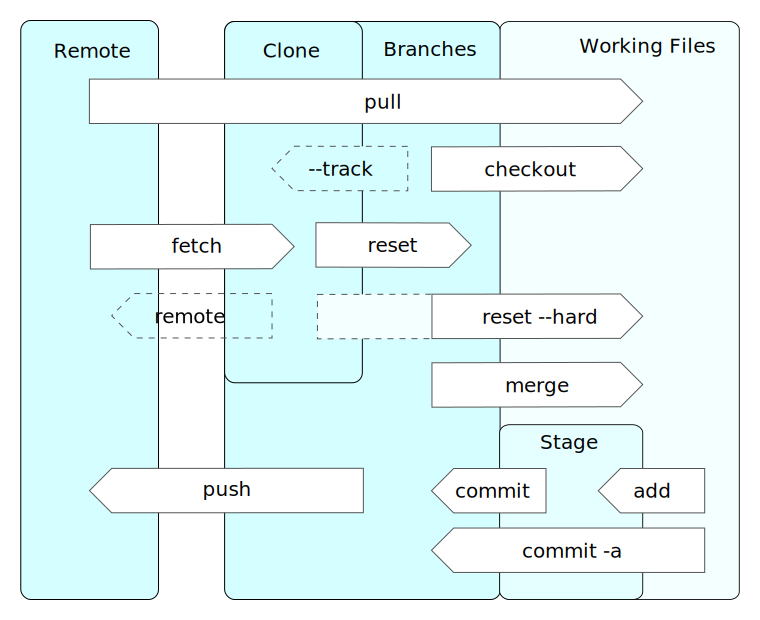
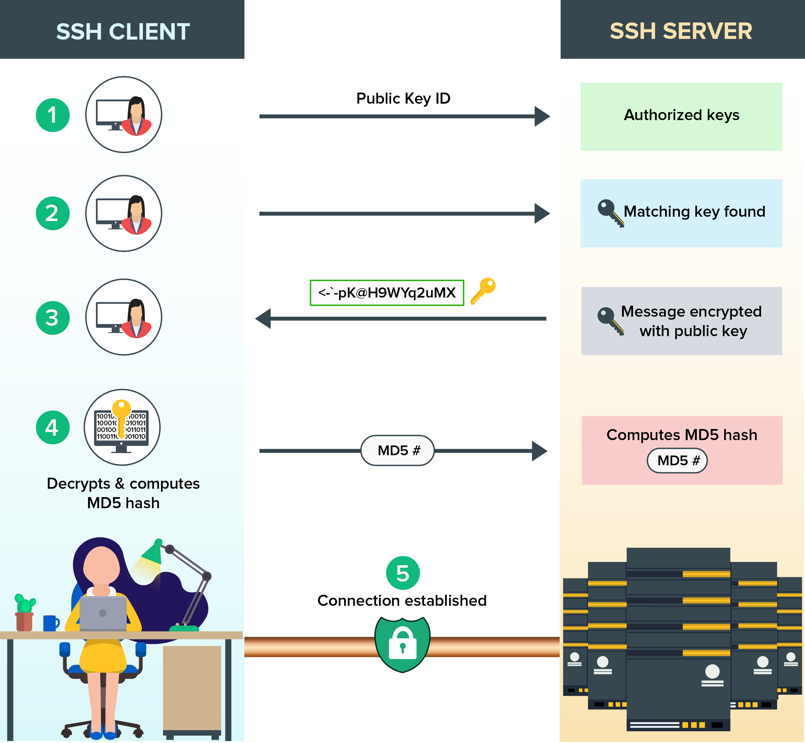
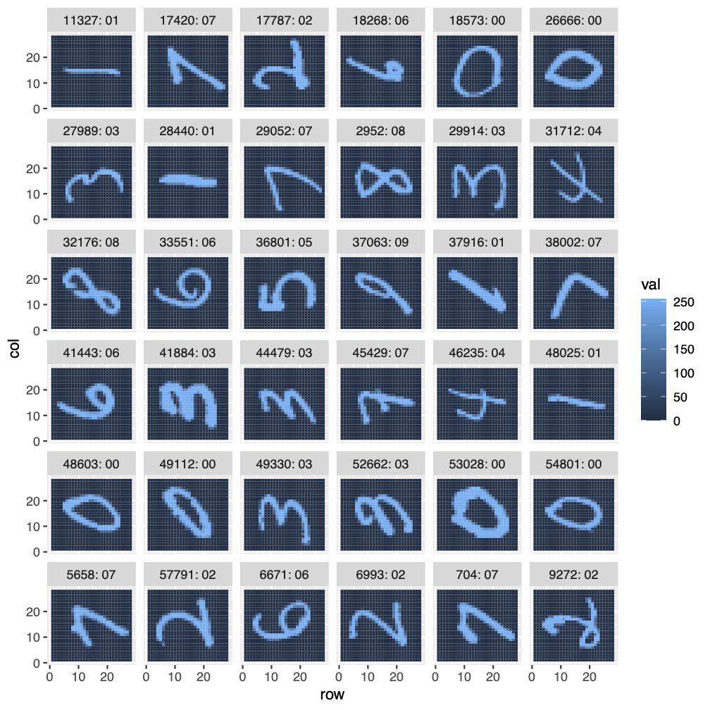
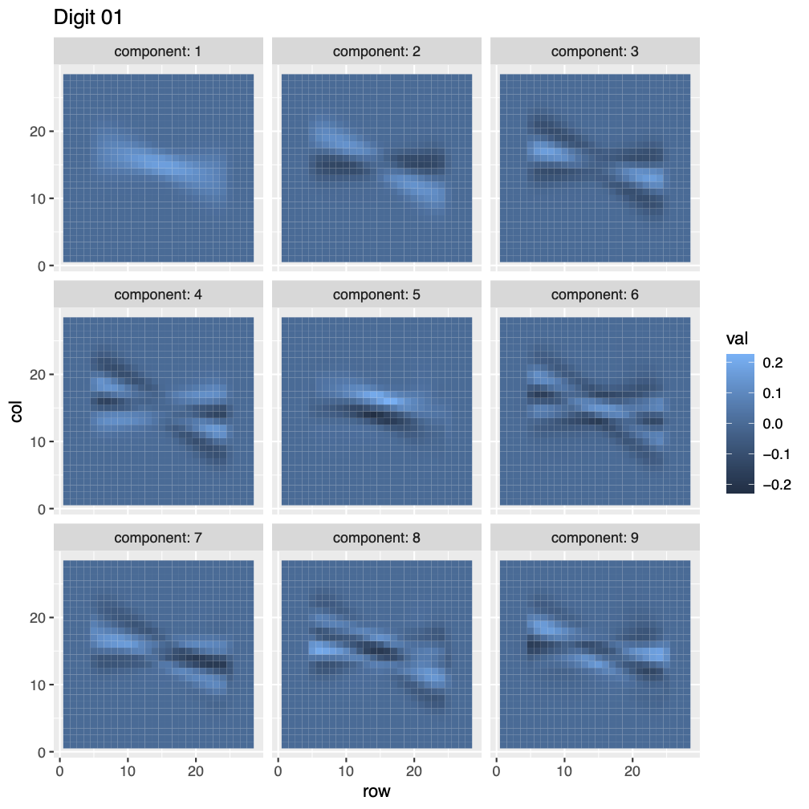
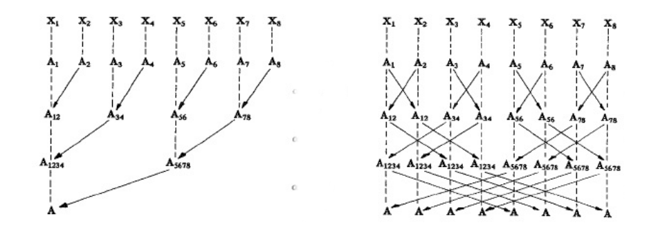

```{r setup, include=FALSE}
options(htmltools.dir.version = FALSE)
xaringanExtra::use_xaringan_extra(c("tile_view", "animate_css", "tachyons"))
hook_source <- knitr::knit_hooks$get('source')
knitr::knit_hooks$set(source = function(x, options) {
  x <- stringr::str_replace(x, "^[[:blank:]]?([^*].+?)[[:blank:]]*#<<[[:blank:]]*$", "*\\1")
  hook_source(x, options)
})
```
# Get this presentation:
`git clone https://github.com/RBigData/R4HPC.git`

* Open <br><br> `R4HPC_Part2.html` <br><br> in your web browser

<br>

Many thanks to my colleagues and former colleagues who contributed to the software and ideas presented here and who are listed in the RBigData Organization on Github: https://github.com/RBigData. Also, many thanks to all R developers of packages used in this presentation.

Any errors are mine alone.
---

## Part I: Software Installatons on Laptop
## Part II: Workflow from Laptop to Cluster
## Part III: Parallel Hardware
## Part IV: Parallel Software
## Part V: Shared Memory Tools
## Part VI: Distributed Memory Tools
---

## Working with a remote cluster using R

```{r echo=FALSE, out.height=500}
knitr::include_graphics("pics/01-intro/Workflow.jpg")
```

---
background-image: url(pics/01-intro//Workflow.jpg)
background-position: top right
background-size: 20%

### Laptop RStudio (Posit in October, 2022)
* Familiar custom editing environment (Windows, Mac, Unix)
* Interactive Syntax checking

### GitHub/GitLab
* Portability to remote computing
* Version control
* Collaboration

### Cluster unix
* Same environment for all
* Batch job submission

#### Advanced: interactive multinode development and debugging in RStudio
* Available now (packages: launchr, pbdCS, pbdRPC, remoter)
* Needs further development (particularly launchr) and standardization

---
background-image: url(pics/01-intro//WorkflowRunning.jpg)
background-position: top right
background-size: 20%

## Running Distributed on a Cluster

```{r echo=FALSE, out.height=500}
knitr::include_graphics("pics/01-intro/BatchRonCluster.jpg")
```

---
background-image: url(pics/01-intro/WorkflowCluster.jpg)
background-position: top right
background-size: 20%

## Job Submission on Cluster

* Command line submission
* Write a shell script to request resources and submit a batch job (preferred)

.pull-left[
#### Slurm (Andes, CADES Condos, Theta, Perlmutter)
<mark>sbatch  *script.sh* </mark> 

<mark>squeue  -u *uid*</mark>

<mark>scancel  *jobnumber*</mark>

]
.pull-right[
#### PBS (Karolina, Barbora)
<mark>qsub   *script.sh* 

<mark>qstat -u *uid*

<mark>qdel  *jobname*</mark>

]  
<br>
* **module** to set software environment (PATH)
  * <mark>*module avail*</mark>
  * <mark>*module list*</mark>
  * <mark>*module load r*</mark>
  * <mark>*module load R*</mark>
  * Other modules may be needed, depending on R setup
  
---
background-image: url(pics/01-intro/WorkflowGit.jpg)
background-position: top left
background-size: 20%

.right[ 
# GitHub and git (laptop to cluster)
]

.w80.pull-left[
```{r echo=FALSE, out.height=450}

```

<font size="-4">*By Daniel Kinzler - Own work, CC BY 3.0, https://commons.wikimedia.org/w/index.php?curid=25223536</font>
]
.w20.pull-right[
<br>
```{r echo=FALSE, out.height=80}
knitr::include_graphics("pics/01-intro/WorkflowCluster.jpg")
```
*pull* to cluster
<br><br><br><br><br><br><br><br><br><br>

```{r echo=FALSE, out.height=80}
knitr::include_graphics("pics/01-intro/WorkflowLaptop.jpg")
```
*commit* on laptop and *push* to GitHub
]
---
# Making it easy: set ssh keys and tokens

* Random string encrypted by public key can be decrypted by private key
* Works like a single-use password generator and authenticator
.w80.pull-left[
```{r echo=FALSE, out.height=400, out.width=450}

```

<font size="-4">Graphic from </font>
```{r echo=FALSE, out.height=10, out.width=300}
knitr::include_graphics("pics/01-intro/ssh-credit.png")
```
]
.w20.pull-right[
Your private key is protected on your local resource

Put your public key on the remote resource to enable easy access

* .ssh directory on cluster has private and public keys, GitHub has public key: enables *pull* on cluster without authentication)
* Generate GitHub token and add to RStudio with ??????????????????

]
---
background-image: url(pics/Mangalore/ParallelSoftware/Slide6.png)
background-position: bottom
background-size: 90%

## Distributed Programming Works in Shared Memory

---
background-image: url(pics/Mangalore/ParallelSoftware/Slide7.png)
background-position: bottom
background-size: 90%

# R Interfaces to Low-Level Native Tools

---
## Truncated SVD as Regression Basis Vectors

Suppose we have $n$ images, each with $p$ pixel values. The well known MNIST data set of digit images is an example with $n = 60\, 000$ and $p = 784\,\, (28\times 28)$.

```{r echo=FALSE, out.height=300}

```

Let $A$ be the matrix of $n_A$ images of a single digit, say digit zero, the pixel values of each image as a column.

---
## Truncated SVD as Regression Basis Vectors

Let $A$ be the matrix of $n_A$ images of a single digit, the pixel values of each image as a column.

The SVD of $A = UDV^T$.
If $u_i$ and $v_i$ are the columns of $U$ and $V$, respectively, 
then 
$$A = \sum_{i=1}^p d_i u_iv_i^T.$$
and image $j$ in column $a_j = \sum_{i=1}^p (d_i v_{ij})u_i.$

From matrix approximation, we know that this SVD can be truncated to some $k \ll p$ components and still represent each image well. 
---
## Truncated SVD as Regression Basis Vectors

For some $k \ll p$, we have $a_j = \sum_{i=1}^k (d_iv_{ij})u_i.$

The $u_i$ are basis functions constructed from data, a set of orthogonalized "images", which are the regressors and the $d_iv_{ij}$ are the regression coefficients.

We can now look at classification of a new image of a digit by regressing it onto each of the 10 digit bases and classifying it into the category that fits best.

The tuning parameter $k$ can be optimized with crossvalidation.

---
# Demo ... MNIST svd regression

.pull-left[
```{r echo=FALSE, out.height=400, fig.align='left'}

```
]
.pull-right[
```{r echo=FALSE, out.height=400, fig.align='left'}
knitr::include_graphics("mnist/five_basis95.png")
```
]
---
background-image: url(pics/Mangalore/ParallelSoftware/Slide7distributed.jpg)
background-position: bottom
background-size: 90%

# Part VI:  $\qquad$  Distributed Memory Tools

---
background-image: url(pics/Mangalore/ParallelSoftware/Slide7mpi.jpg)
background-position: bottom
background-size: 90%

# Message Passing Interface (MPI)
---
background-image: url(pics/Mangalore/ParallelSoftware/Slide7mpi.jpg)
background-position: top right
background-size: 20%
# pbdR - MPI
```{r echo=FALSE, out.height=100, fig.align='left'}
knitr::include_graphics("pics/01-intro/pbdRlib.jpg")
```

* MPI: Message Passing Interface - *de facto* standard for distributed communication in supercomputing

   * Used for data mostly via collective communication - high level

   * `pbdMPI`, `kazaam`, and `cop` R packages
???

* Prefer pbdMPI over Rmpi due to simplification and speed
   * No serialization for arrays and vectors
* Drops spawning a cluster because a client-server relationship is better


---
background-image: url(pics/Mangalore/ParallelSoftware/Slide7mpi.jpg)
background-position: top right
background-size: 20%

# Single Program Multiple Data (SPMD)
#### Hello world!

```{r eval = FALSE, code = readLines("mpi/hello_world.R")}
```

#### One code and a parallel mindset
#### A generalization of a serial code
#### Many rank-aware operations are automated
#### No manager, it is all cooperation
#### Explicit point-to-point communications are an advanced topic
---
background-image: url(pics/Mangalore/ParallelSoftware/Slide7mpi.jpg)
background-position: top right
background-size: 20%

# High-level Collective Communications

$$\bf A = \sum_{i=1}^nX_i$$

#### `pbdMPI`: $\qquad$ **reduce(X)** $\qquad$ $\qquad$ $\qquad$ **allreduce(X**)
$$\bf A = \left[ X_1 | X_2 | \cdots | X_n \right]$$
#### `pbdMPI`: $\qquad$ **gather(X)** $\qquad$ $\qquad$ $\qquad$ **allgather(X**)
```{r echo=FALSE, out.height=250, fig.align='left'}

```

---
background-image: url(pics/Mangalore/ParallelSoftware/Slide7mpi.jpg)
background-position: top right
background-size: 20%

# Demo ... <br><br> MPI communication in SPMD programming

---
background-image: url(pics/Mangalore/ParallelSoftware/Slide7mpi.jpg)
background-position: top right
background-size: 20%
# pbdR - ScaLAPACK - MPI
.pull-left[
```{r echo=FALSE, out.height=100, fig.align='left'}
knitr::include_graphics("pics/01-intro/pbdRlib.jpg")
```
]
.pull-right[
**pbdr.org**
]

* ScaLAPACK: Scalable LAPACK - Distributed version of LAPACK (uses PBLAS/BLAS but not LAPACK)

   * 2d Block-Cyclic data layout - mostly automated in `pbdDMAT` package
   
   * BLACS: Communication collectives for distributed matrix computation
   * PBLAS: BLAS - distributed BLAS (uses shared memory BLAS within blocks)

   * `pbdDMAT` and `pbdML` R packages - most matrix operations identical to serial through overloading operators and `ddmatrix` class

---
background-image: url(pics/Mangalore/ParallelSoftware/Slide7mpi.jpg)
background-position: top right
background-size: 20%

## Constructing a Distributed Matrix from Data

* Each MPI rank reads different data in a contiguous block

.pull-left[
$$\large\left[\begin{array}{ccc}a_{11}&a_{12}&a_{13}\\[1ex]a_{21}&a_{22}&a_{23}\\[1ex] a_{31}&a_{32}&a_{33}\end{array}\right]$$  
$$\large\left[\begin{array}{ccc}a_{11}&a_{12}&a_{13}\\[1ex]a_{21}&a_{22}&a_{23}\\[1ex] a_{31}&a_{32}&a_{33}\end{array}\right]$$
]
.pull-right[
$$\qquad$$  

$\large a_{11}\;a_{12}\;a_{13}\;a_{21}\;a_{22}\;a_{23}\;a_{31}\;a_{32}\;a_{33}$  

C, C++, NumPy $\quad$ **Row-Block**

$$\qquad$$  
$$\qquad$$  
$\large a_{11}\;a_{21}\;a_{31}\;a_{12}\;a_{22}\;a_{32}\;a_{13}\;a_{23}\;a_{33}$  

Fortran, R, Matlab  $\quad$ **Column-Block**
]

* Each MPI rank adds attributes for global context

---
background-image: url(pics/Mangalore/ParallelSoftware/Slide7mpi.jpg)
background-position: top right
background-size: 20%

# Demo ... <br><br> ScaLAPACK via pbdDMAT

---
## Randomized sketching algorithms
<br><br>
Fast new alternatives to classical numerical linear algebra computations. 

<br>
Guarantees are given with probability statements instead of classical error analysis.

<br> <br>
Martinsson, P., & Tropp, J. (2020). Randomized numerical linear algebra: Foundations and algorithms. Acta Numerica, 29, 403-572. [https://doi.org/10.48550/arXiv.2002.01387](https://doi.org/10.48550/arXiv.2002.01387)
---
`mnist_rsvd.R`
```{r eval=FALSE, code = readLines("mpi/mnist_rsvd.R")}
```

---
background-image: url(pics/Mangalore/ParallelSoftware/Slide7mpi.jpg)
background-position: top right
background-size: 20%

## Randomized SVD via subspace embedding
Given an $n\times p$ matrix $X$ and $k = r + 10$, where $r$ is the *effective rank* of $X$:  
1. Construct a $p\times k$ random matrix $\Omega$
2. Form $Y = X \Omega$
3. Decompose $Y = QR$

$Q$ is an orthogonal basis for the columnspace of $Y$, which with high probability is the columnspace of $X$. To get the SVD of $X$:  
1. Compute $C= Q^TX$
2. Decompose $C = \hat{U}\Sigma V^T$
3. Compute $U = Q\hat{U}$
4. Truncate factorization to $r$ columns

---
background-image: url(pics/Mangalore/ParallelSoftware/Slide7mpi.jpg)
background-position: top right
background-size: 20%

## Randomized SVD via subspace embedding
Given an $n\times p$ matrix $X$ and $k = r + 10$, where $r$ is the *effective rank* of $X$:  
1. Construct a $p\times k$ random matrix $\Omega$
2. Let $Y_0 = \Omega$
3. For $i$ in $1:q$
   2. Decompose $Y_{i-1} = Q_{i}R_{i}$
   1. $Y_i = X(X^TQ_i)$
4. Decompose $Y_q = QR$

$Q$ is an orthogonal basis for the columnspace of $Y$, which with high probability is the columnspace of $X$. To get the SVD of $X$:  
1. Compute $C= Q^TX$
2. Decompose $C = \hat{U}\Sigma V^T$
3. Compute $U = Q\hat{U}$
4. Truncate factorization to $r$ columns


