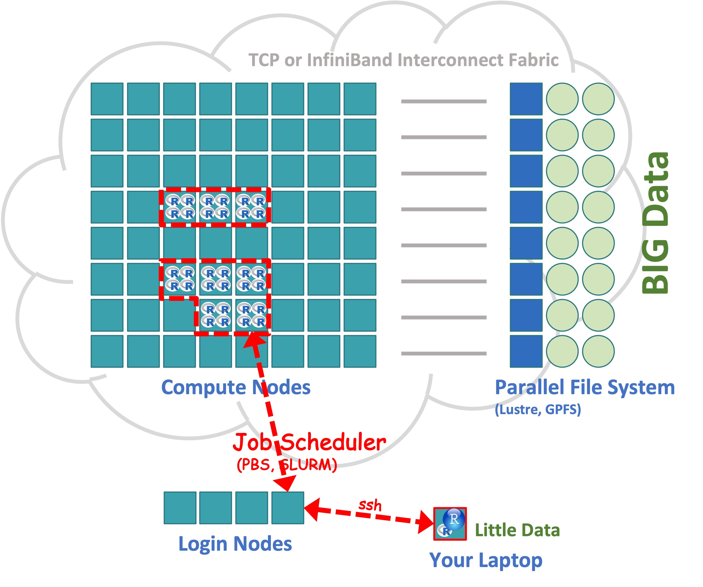

```{r setup, include=FALSE}
options(htmltools.dir.version = FALSE)
xaringanExtra::use_xaringan_extra(c("tile_view", "animate_css", "tachyons"))
hook_source <- knitr::knit_hooks$get('source')
knitr::knit_hooks$set(source = function(x, options) {
  x <- stringr::str_replace(x, "^[[:blank:]]?([^*].+?)[[:blank:]]*#<<[[:blank:]]*$", "*\\1")
  hook_source(x, options)
})
```
# Get this presentation: 
`git clone https://github.com/RBigData/R4HPC.git`

* Open <br><br>`R4HPC_Part2.html` <br><br> in your web browser (help ? toggle)
<br>

Slack workspace link for this workshop was emailed to you. 
<br><br><br><br>

*Many thanks to my colleagues and former colleagues who contributed to the software and ideas presented here. See the RBigData Organization on Github: https://github.com/RBigData. Also, many thanks to all R developers of packages used in this presentation.*

*Slides are made with the xaringan R package. It is an R Markdown extension based on the JavaScript library remark.js.*

---
# Today's Package Installs

## See `R4HPC/code_4` R script and shell scripts for your machine

---
## Running MPI on a Laptop

macOS in a Terminal window:

* `brew install openmpi`
* `mpirun -np 4 Rscript your_spmd_code.R`

Windows

* Web Page: https://docs.microsoft.com/en-us/message-passing-interface/microsoft-mpi
* Download: https://www.microsoft.com/en-us/download/details.aspx?id=100593
* `pbdMPI` has a Windows binary on CRAN

---
## Revisit `hello_balance.R` in `code_1`

```{r eval = FALSE, code = readr::read_lines("code_1/hello_balance.R", skip=8),  }
```

---

## Working with a remote cluster using R

```{r echo=FALSE, out.height=500}
knitr::include_graphics("pics/01-intro/Workflow.jpg")
```

---
background-image: url(pics/01-intro//WorkflowRunning.jpg)
background-position: top right
background-size: 20%

## Running Distributed on a Cluster

```{r echo=FALSE, out.height=500}

```

---

## Section I: Environment and Workflow
## Section II: Parallel Hardware and Software Overview
## Section III: Shared Memory Tools
## <mark>Section IV:</mark> **Distributed Memory Tools**

---
background-image: url(pics/Mangalore/ParallelSoftware/Slide7distributed.jpg)
background-position: bottom
background-size: 90%

# Distributed Memory Tools

---
background-image: url(pics/Mangalore/ParallelSoftware/Slide7mpi.jpg)
background-position: bottom
background-size: 90%

# Message Passing Interface (MPI)

---
background-image: url(pics/Mangalore/ParallelSoftware/Slide7mpi.jpg)
background-position: top right
background-size: 20%

## Single Program Multiple Data (SPMD)

* N instances of the same code cooperate
  * Each of the N instances has `rank`, {0, . . ., N-1}
  * The `rank` determines any differences in work
  * Instances run asynchronously 

* SPMD parallelization is a generalization of the serial code
  * Many rank-aware operations are automated
  * Collective operations are high level and easy to learn
  * Explicit point-to-point communications are an advanced topic
  * Multilevel parallelism is possible

* Typically no manager, it is all cooperation
  
---
background-image: url(pics/Mangalore/ParallelSoftware/Slide7mpi.jpg)
background-position: top right
background-size: 20%
# pbdR Project
```{r echo=FALSE, out.height=180, fig.align='left'}
knitr::include_graphics("pics/01-intro/pbdRlib.jpg")
```
* Bridge HPC with high-productivity of R: Expressive for data and modern statistics

* Keep syntax identical to R, when possible

* Software reuse philosophy:

   * Don't reinvent the wheel when possible
   * Introduce HPC standards with R flavor
   * Use scalable HPC libraries with R convenience

* Simplify and use R intelligence where possible
???
Using HPC concepts and libraries 
* Benefits the R user by knowing standard components of HPC

---
background-image: url(pics/Mangalore/ParallelSoftware/Slide7mpi.jpg)
background-position: top right
background-size: 20%
```{r echo=FALSE, out.height=80, fig.align='left'}
knitr::include_graphics("pics/01-intro/pbdRlib.jpg")
```
# Package `pbdMPI`

* Specializes in SPMD programming for HPC clusters
   * Manages printing from ranks
   * Provides chunking options
   * Provides communicator splits for multilevel parallelism
   * In situ capability to process data from other MPI codes without copy 

* A derivation and rethinking of the `Rmpi` package aimed at HPC clusters

   * Simplified interface with fewer parameters (using R's S4 methods)
   * Faster for matrix and array data - no serialization


???

* Prefer pbdMPI over Rmpi due to simplification and speed
   * No serialization for arrays and vectors
* Drops spawning a cluster
  * Because a client-server relationship is more appropriate
---
background-image: url(pics/Mangalore/ParallelSoftware/Slide7mpi.jpg)
background-position: top right
background-size: 20%

## `pbdMPI`: High-level Collective Communications

Each of these operations is performed across a `communicator` of ranks. Simplest one is all ranks but rank arrays can be used for multilevel collectives.

* **`reduce()`** Reduces a set of same-size distributed vectors or arrays with an operation (+ is default). Fast because both communication and reduction are parallel and no serialization is needed.

* **`allreduce()`** Same as `reduce()` except all ranks in a `comm` get the result

* **`gather()`** Gathers a set of distributed objects 

* **`allgather()`** Same as `gather()` except all ranks in a `comm` get the result

* **`bcast()`** Broadcasts an object from one rank to all in its `comm`

* **`scatter()`** Broadcasts different pieces of an object from one rank to all in its `comm`

* **`barrier()`** Waits on all ranks in a `comm` before proceeding 
---
background-image: url(pics/Mangalore/ParallelSoftware/Slide7mpi.jpg)
background-position: top right
background-size: 20%

## `pbdMPI`: High-level Collective Operations
$\small \bf A = \sum_{i=1}^nX_i$ $\quad$ $\qquad$ $\qquad$ **`A = reduce(X)`** $\qquad$ $\qquad$ **`A = allreduce(X)`**  

$\small \bf A = \left[ X_1 | X_2 | \cdots | X_n \right]$ $\qquad$ **`A = gather(X)`** $\qquad$ $\qquad$ **`A = allgather(X)`**

```{r echo=FALSE, out.height=250, fig.align='right'}
knitr::include_graphics("pics/01-intro/RHistory3sub.png")
```
???
* Powerful: communication and reduction is highly parallel
   * that's why it beats Spark/MapReduce

---
background-image: url(pics/Mangalore/ParallelSoftware/Slide7mpi.jpg)
background-position: top right
background-size: 20%

## `pbdMPI`: Functions to Facilitate SPMD Programming

* **`comm.chunk()`** splits a number into chunks in various ways and various formats. Tailored for SPMD programming, returning rank-specific results.

* **`comm.set.seed()`** sets the seed of a parallel RNG. If diff = FALSE, then all ranks generate the same stream. Otherwise, ranks generate different streams.

* **`comm.print()`** and **`comm.cat()`** print by default from rank 0 only, with options to print from any or all ranks.

---
background-image: url(pics/Mangalore/ParallelSoftware/Slide6.png)
background-position: bottom
background-size: 90%

## Distributed Programming Works in Shared Memory

---
background-image: url(pics/Mangalore/ParallelSoftware/Slide7mpi.jpg)
background-position: top right
background-size: 20%

## Hands on Session 5: Hello MPI Ranks

`code_5/hello_world.R`
```{r eval = FALSE, code = readLines("code_5/hello_world.R")}
```

### **Rank** distinguishes the parallel copies of the same code
---
### Hands-on Session 5 - `R4HPC/code_2/rf_serial.R`
```{r eval=FALSE, code = readLines("code_2/rf_serial.R")}
```
---
background-image: url(pics/Mangalore/ParallelSoftware/Slide7mpi.jpg)
background-position: top right
background-size: 20%

## Hands on Session 5: Random Forest with MPI

`code_5/rf_mpi.R`
```{r eval = FALSE, code = readLines("code_5/rf_mpi.R")}
```


---
## Hands on Session 5: `comm.chunk()`

`mpi_shorts/chunk.r`
```{r eval = FALSE, code = readLines("mpi_shorts/chunk.r")}
```
---
## Hands on Session 5: other short MPI codes

bcast.r  chunk.r comm_split.R  cov.r  gather-named.r  gather.r  gather-unequal.r  hello-p.r  hello.r  map-reduce.r  mcsim.r  ols.r  qr-cop.r  rank.r  reduce-mat.r  timer.r

* These short codes only use `pbdMPI` and can run on a laptop in a terminal window if you installed OpenMPI
* On the clusters these can run on a login node with a small $^*$ number of ranks
* Wile in the `mpi_shorts` directory, run the following
   * `source ../code_4/modules_MACHINE.sh`
   * `mpirun -np 4 Rscript your_script.r`

.footnote[
$^*$ Note that running long or large jobs on login nodes is strongly discouraged
]
---
## Shared Memory - MPI or fork?
.w80.pull-left[
*  fork via `mclapply()` + `do.call()` combine  
```{r echo=FALSE, out.height=150}
knitr::include_graphics("pics/mpi/fork.jpg")
```
* MPI replicated data + `allreduce()`  
```{r echo=FALSE, out.height=150}
knitr::include_graphics("pics/mpi/mpi-replicate.png")
```

* MPI chunked data + `allreduce()`  
```{r echo=FALSE, out.height=58} 

```
]
.w20.pull-right[
`do.call()` is serial

`allreduce()` is parallel
]
---
background-image: url(pics/Mangalore/ParallelSoftware/Slide7mpi.jpg)
background-position: top right
background-size: 20%
```{r echo=FALSE, out.height=100, fig.align='left'}
knitr::include_graphics("pics/01-intro/pbdRlib.jpg")
```
# Package `pbdDMAT`

* ScaLAPACK: Distributed version of LAPACK (uses PBLAS/BLAS but not LAPACK)

   * 2d Block-Cyclic data layout - mostly automated in `pbdDMAT` package
   
   * BLACS: Communication collectives for distributed matrix computation
   * PBLAS: Distributed BLAS (uses standard BLAS within blocks)

* R code is identical for most matrix operations by overloading operators and `ddmatrix` class

---
background-image: url(pics/Mangalore/ParallelSoftware/Slide7mpi.jpg)
background-position: top right
background-size: 20%
```{r echo=FALSE, out.height=100, fig.align='left'}
knitr::include_graphics("pics/01-intro/pbdRlib.jpg")
```
# Package `pbdML`

* A demonstration of `pbdDMAT` package capabilities

* Includes
  * Randomized SVD
  * Randomized principal components analysis
  * Robust Principal Component Analysis?" 
    from https://arxiv.org/pdf/0912.3599.pdf

---
## Hands on Session $\quad$ rsvd:
#### Singular value decomposition via randomized sketching
<br><br>
Randomized sketching produces fast new alternatives to classical numerical linear algebra computations. 

<br>
Guarantees are given with probability statements instead of classical error analysis.

<br> <br>
Martinsson, P., & Tropp, J. (2020). Randomized numerical linear algebra: Foundations and algorithms. Acta Numerica, 29, 403-572. [https://doi.org/10.48550/arXiv.2002.01387](https://doi.org/10.48550/arXiv.2002.01387)
---
background-image: url(pics/Mangalore/ParallelSoftware/Slide7mpi.jpg)
background-position: top right
background-size: 20%

## Hands on Session $\quad$ rsvd:
#### Randomized SVD via subspace embedding
Given an $n\times p$ matrix $X$ and $k = r + 10$, where $r$ is the *effective rank* of $X$:  
1. Construct a $p\times k$ random matrix $\Omega$
2. Form $Y = X \Omega$
3. Decompose $Y = QR$

$Q$ is an orthogonal basis for the columnspace of $Y$, which with high probability is the columnspace of $X$. To get the SVD of $X$:  
1. Compute $C= Q^TX$
2. Decompose $C = \hat{U}\Sigma V^T$
3. Compute $U = Q\hat{U}$
4. Truncate factorization to $r$ columns

---
background-image: url(pics/Mangalore/ParallelSoftware/Slide7mpi.jpg)
background-position: top right
background-size: 20%
## MNIST Data

```{r echo=FALSE, out.height=500, fig.align='left'}
knitr::include_graphics("pics/mnist/Rplots.png")
```

---
`mnist_rsvd.R`
```{r eval=FALSE, code = readLines("rsvd/mnist_rsvd.R")}
```

---
### Hands-on Sessionrsvd
```{r eval=FALSE, code = readLines("rsvd/rsvd_snippet.donotrun")}
```
---
background-image: url(pics/Mangalore/ParallelSoftware/Slide7mpi.jpg)
background-position: top right
background-size: 20%
```{r echo=FALSE, out.height=100, fig.align='left'}
knitr::include_graphics("pics/01-intro/pbdRlib.jpg")
```
# Package `kazaam`

* Distributed methods for tall matrices (and some for wide matrices) that exploit the short dimension for speed and long dimension for parallelism

* Tall matrices, `shaq` class, are chunked by blocks of rows adn wide matrices, `tshaq` class, by blocks of columns

* Much like `pbdDMAT`, most matrix operations in R code are identical to serial through overloading operators and `shaq` `S4` class

.footnote[
Naming is a "tongue-in-cheek" play on 'Shaquille' 'ONeal' ('Shaq') and the film 'Kazaam'
]

---
# Hands on Session `kazaam`

To be added
