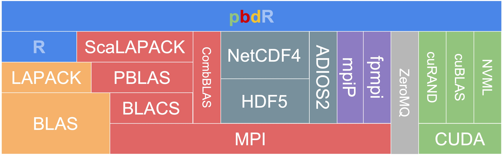
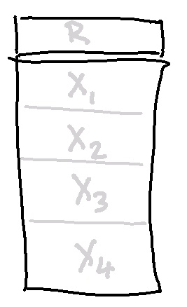

```{r setup, include=FALSE}
options(htmltools.dir.version = FALSE)
xaringanExtra::use_xaringan_extra(c("tile_view", "animate_css", "tachyons"))
hook_source <- knitr::knit_hooks$get('source')
knitr::knit_hooks$set(source = function(x, options) {
  x <- stringr::str_replace(x, "^[[:blank:]]?([^*].+?)[[:blank:]]*#<<[[:blank:]]*$", "*\\1")
  hook_source(x, options)
})
```
# Get this presentation: 
`git clone https://github.com/RBigData/R4HPC.git`

* Open <br><br>`R4HPC_Part2.html` <br><br> in your web browser (help ? toggle)
<br>

Slack workspace link for this workshop was emailed to you. 
<br><br><br><br>

*Many thanks to my colleagues and former colleagues who contributed to the software and ideas presented here. See the RBigData Organization on Github: https://github.com/RBigData. Also, many thanks to all R developers of packages used in this presentation.*

*Slides are made with the xaringan R package. It is an R Markdown extension based on the JavaScript library remark.js.*

---

## Working with a remote cluster using R

```{r echo=FALSE, out.height=500}
knitr::include_graphics("pics/01-intro/Workflow.jpg")
```

---
background-image: url(pics/01-intro//WorkflowRunning.jpg)
background-position: top right
background-size: 20%

## Running Distributed on a Cluster

```{r echo=FALSE, out.height=500}
knitr::include_graphics("pics/01-intro/BatchRonCluster.jpg")
```

---

## Section I: Environment and Workflow
## Section II: Parallel Hardware and Software Overview
## Section III: Shared Memory Tools
## Section IV: **Distributed Memory Tools**

---
background-image: url(pics/Mangalore/ParallelSoftware/Slide7distributed.jpg)
background-position: bottom
background-size: 90%

# Distributed Memory Tools

---
background-image: url(pics/Mangalore/ParallelSoftware/Slide7mpi.jpg)
background-position: bottom
background-size: 90%

# Message Passing Interface (MPI)
---
background-image: url(pics/Mangalore/ParallelSoftware/Slide7mpi.jpg)
background-position: bottom
background-size: 90%

# Distributed Computing and MPI

* Must be 


---
background-image: url(pics/Mangalore/ParallelSoftware/Slide7mpi.jpg)
background-position: top right
background-size: 20%
# pbdR Project
```{r echo=FALSE, out.height=180, fig.align='left'}

```
* Bridge HPC with high-productivity of R: Expressive for data and modern statistics

* Keep syntax identical to R, when possible

* Software reuse philosophy:

   * Don't reinvent the wheel when possible
   * Introduce HPC standards with R flavor
   * Use scalable HPC libraries with R convenience

* Simplify and use R intelligence where possible
???
Using HPC concepts and libraries 
* Benefits the R user by knowing standard components of HPC

---
background-image: url(pics/Mangalore/ParallelSoftware/Slide7mpi.jpg)
background-position: top right
background-size: 20%
```{r echo=FALSE, out.height=80, fig.align='left'}

```
# Package `pbdMPI`

* Specializes in SPMD programming for HPC clusters
   * Manages printing from ranks
   * Provides chunking options
   * Provides communicator splits for multilevel parallelism
   * In situ capability to process data from other MPI codes without copy 

* A derivation and rethinking of the `Rmpi` package aimed at HPC clusters

   * Simplified interface with fewer parameters (using R's S4 methods)
   * Faster for matrix and array data - no serialization


???

* Prefer pbdMPI over Rmpi due to simplification and speed
   * No serialization for arrays and vectors
* Drops spawning a cluster
  * Because a client-server relationship is more appropriate

---
background-image: url(pics/Mangalore/ParallelSoftware/Slide7mpi.jpg)
background-position: top right
background-size: 20%

## Single Program Multiple Data (SPMD)

* One code and a parallel mindset

* A generalization of a serial code

* Many rank-aware operations are automated

* Collective operations are high level and easy to learn

* Explicit point-to-point communications are an advanced topic

* No manager, it is all cooperation


---
background-image: url(pics/Mangalore/ParallelSoftware/Slide7mpi.jpg)
background-position: top right
background-size: 20%

# High-level Collective Communications
$$\bf A = \sum_{i=1}^nX_i$$
#### `pbdMPI`: $\qquad$ **A = reduce(X)** $\qquad$ $\qquad$ $\qquad$ **A = allreduce(X**)
$$\bf A = \left[ X_1 | X_2 | \cdots | X_n \right]$$
#### `pbdMPI`: $\qquad$ **A = gather(X)** $\qquad$ $\qquad$ $\qquad$ **A = allgather(X**)
```{r echo=FALSE, out.height=250, fig.align='left'}
knitr::include_graphics("pics/01-intro/RHistory3sub.png")
```
---
background-image: url(pics/Mangalore/ParallelSoftware/Slide7mpi.jpg)
background-position: top right
background-size: 20%

## Hands on Session 5: Hello MPI Ranks

`code_5/hello_world.R`
```{r eval = FALSE, code = readLines("code_5/hello_world.R")}
```

### **Rank** distinguishes the parallel copies of the same code
---
background-image: url(pics/Mangalore/ParallelSoftware/Slide7mpi.jpg)
background-position: top right
background-size: 20%

## Hands on Session 5: Random Forest with MPI

`code_5/rf_mpi.R`
```{r eval = FALSE, code = readLines("code_5/rf_mpi.R")}
```

---
# comm.chunk()

---
background-image: url(pics/Mangalore/ParallelSoftware/Slide7mpi.jpg)
background-position: top right
background-size: 20%

# Demo ... <br><br> MPI communication in SPMD programming

---
background-image: url(pics/Mangalore/ParallelSoftware/Slide7mpi.jpg)
background-position: top right
background-size: 20%
# pbdR - ScaLAPACK - MPI
.pull-left[
```{r echo=FALSE, out.height=100, fig.align='left'}

```
]
.pull-right[
**pbdr.org**
]

* ScaLAPACK: Scalable LAPACK - Distributed version of LAPACK (uses PBLAS/BLAS but not LAPACK)

   * 2d Block-Cyclic data layout - mostly automated in `pbdDMAT` package
   
   * BLACS: Communication collectives for distributed matrix computation
   * PBLAS: BLAS - distributed BLAS (uses shared memory BLAS within blocks)

   * `pbdDMAT` and `pbdML` R packages - most matrix operations identical to serial through overloading operators and `ddmatrix` class
---
background-image: url(pics/Mangalore/ParallelSoftware/Slide6.png)
background-position: bottom
background-size: 90%

## Distributed Programming Works in Shared Memory

---
# Shared Memory - MPI or fork?
```{r echo=FALSE, out.height=150}

```
```{r echo=FALSE, out.height=58}
knitr::include_graphics("pics/mpi/mpi-partition.png")
```
<br>
```{r echo=FALSE, out.height=150}

```


---
background-image: url(pics/Mangalore/ParallelSoftware/Slide7mpi.jpg)
background-position: top right
background-size: 20%

## Constructing a Distributed Matrix from Data

* Each MPI rank reads different data in a contiguous block

.pull-left[
$$\large\left[\begin{array}{ccc}a_{11}&a_{12}&a_{13}\\[1ex]a_{21}&a_{22}&a_{23}\\[1ex] a_{31}&a_{32}&a_{33}\end{array}\right]$$  
$$\large\left[\begin{array}{ccc}a_{11}&a_{12}&a_{13}\\[1ex]a_{21}&a_{22}&a_{23}\\[1ex] a_{31}&a_{32}&a_{33}\end{array}\right]$$
]
.pull-right[
$$\qquad$$  

$\large a_{11}\;a_{12}\;a_{13}\;a_{21}\;a_{22}\;a_{23}\;a_{31}\;a_{32}\;a_{33}$  

C, C++, NumPy $\quad$ **Row-Block**

$$\qquad$$  
$$\qquad$$  
$\large a_{11}\;a_{21}\;a_{31}\;a_{12}\;a_{22}\;a_{32}\;a_{13}\;a_{23}\;a_{33}$  

Fortran, R, Matlab  $\quad$ **Column-Block**
]

* Each MPI rank adds attributes for global context

---
background-image: url(pics/Mangalore/ParallelSoftware/Slide7mpi.jpg)
background-position: top right
background-size: 20%

# Demo ... <br><br> ScaLAPACK via pbdDMAT

---
## Randomized sketching algorithms
<br><br>
Fast new alternatives to classical numerical linear algebra computations. 

<br>
Guarantees are given with probability statements instead of classical error analysis.

<br> <br>
Martinsson, P., & Tropp, J. (2020). Randomized numerical linear algebra: Foundations and algorithms. Acta Numerica, 29, 403-572. [https://doi.org/10.48550/arXiv.2002.01387](https://doi.org/10.48550/arXiv.2002.01387)
---
`mnist_rsvd.R`
```{r eval=FALSE, code = readLines("mpi/mnist_rsvd.R")}
```

---
background-image: url(pics/Mangalore/ParallelSoftware/Slide7mpi.jpg)
background-position: top right
background-size: 20%

## Randomized SVD via subspace embedding
Given an $n\times p$ matrix $X$ and $k = r + 10$, where $r$ is the *effective rank* of $X$:  
1. Construct a $p\times k$ random matrix $\Omega$
2. Form $Y = X \Omega$
3. Decompose $Y = QR$

$Q$ is an orthogonal basis for the columnspace of $Y$, which with high probability is the columnspace of $X$. To get the SVD of $X$:  
1. Compute $C= Q^TX$
2. Decompose $C = \hat{U}\Sigma V^T$
3. Compute $U = Q\hat{U}$
4. Truncate factorization to $r$ columns

---
background-image: url(pics/Mangalore/ParallelSoftware/Slide7mpi.jpg)
background-position: top right
background-size: 20%

## Randomized SVD via subspace embedding
Given an $n\times p$ matrix $X$ and $k = r + 10$, where $r$ is the *effective rank* of $X$:  
1. Construct a $p\times k$ random matrix $\Omega$
2. Let $Y_0 = \Omega$
3. For $i$ in $1:q$
   2. Decompose $Y_{i-1} = Q_{i}R_{i}$
   1. $Y_i = X(X^TQ_i)$
4. Decompose $Y_q = QR$

$Q$ is an orthogonal basis for the columnspace of $Y$, which with high probability is the columnspace of $X$. To get the SVD of $X$:  
1. Compute $C= Q^TX$
2. Decompose $C = \hat{U}\Sigma V^T$
3. Compute $U = Q\hat{U}$
4. Truncate factorization to $r$ columns


