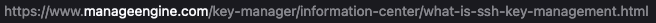

```{r setup, include=FALSE}
options(htmltools.dir.version = FALSE)
xaringanExtra::use_xaringan_extra(c("tile_view", "animate_css", "tachyons"))
hook_source <- knitr::knit_hooks$get('source')
knitr::knit_hooks$set(source = function(x, options) {
  x <- stringr::str_replace(x, "^[[:blank:]]?([^*].+?)[[:blank:]]*#<<[[:blank:]]*$", "*\\1")
  hook_source(x, options)
})
```
# Get this presentation:
`https://github.com/RBigData/ROBUST2022/archive/refs/heads/main.zip`

* Unzip

* Open <br><br>`ROBUST2022-main/Robust2022.html` <br><br> in your web browser

* In this class, we will also show how to get it more directly with **git**
---
# Why HPSC?

* More memory  

* Faster code

* Statisticians are needed in HPC

# What is Fast Enough?

* Methodology: seconds

* Optimize parameters: 100 to 1000 $\times$ methodology

* Bootstrap uncertainty in optimization: 100 to 1000 $\times$ optimization

### Faster code can do more
---

## Part I: Software Installatons on Laptop
## Part II: Workflow from Laptop to Cluster
## Part III: Parallel Hardware
## Part IV: Parallel Software
## Part V: Shared Memory Tools
## Part VI: Distributed Memory Tools
---

## Part I: <br> <br> Software Installatons on a Laptop for work with a Cluster
---
### For work with a cluster
* Mac
   * R, RStudio
   
   * terminal, git (in Xcode app)
   
* Windows
   * R, RStudio
   
   * putty
   
   * git
   
   * WinSCP
---

## Links for Software on Laptop and Access

* RStudio:  [RStudio Desktop Free](https://www.rstudio.com/products/rstudio/download/) 

* git: [RStudio with Git](https://support.rstudio.com/hc/en-us/articles/200532077-Version-Control-with-Git-and-SVN)

* ssh: [Wikipedia ssh](https://en.wikipedia.org/wiki/Secure_Shell)

* IT4Innovations:
   * [Get Project](https://docs.it4i.cz/general/applying-for-resources/)
      * [Example application](pics/IT4I/DD-form.pdf)

   * [Access](https://docs.it4i.cz/general/shell-and-data-access/)
   
   * [ssh](https://docs.it4i.cz/general/accessing-the-clusters/shell-access-and-data-transfer/ssh-key-management/)

   * [Windows](https://docs.it4i.cz/general/accessing-the-clusters/shell-access-and-data-transfer/putty/)

* Karlova Universita MFF:

   * [Sněhurka](https://cluster.karlin.mff.cuni.cz/pouziti-clusteru/)

   * [Chiméra](https://www.mff.cuni.cz/cs/verejnost/aktuality/otevreni-fakultniho-hpc-clusteru)

---
## For faster R on your macOS laptop

```{r eval=FALSE}
## Default BLAS from Netlib
> x = matrix(rnorm(1e7), nrow = 1e4)
> system.time(crossprod(x))
   user  system elapsed 
  6.752   0.023   6.801 
```
* Apple vecLib (via Xcode) can be swapped in  

`ln -sf /Library/Frameworks/R.framework/Resources/lib/libRblas.veclib.dylib /Library/Frameworks/R.framework/Resources/lib/libRblas.dylib`
* Or `brew install openblas`, and link OpenBLAS to R

`ln -sf /usr/local/opt/openblas/lib/libopenblas.dylib /Library/Frameworks/R.framework/Resources/lib/libRblas.dylib`
.pull-left[
```{r eval=FALSE}
## vecLib
> system.time(crossprod(x))
   user  system elapsed 
  0.666   0.003   0.120 
```
]
.pull-right[
```{r eval=FALSE}
## OpenBLAS
   > system.time(crossprod(x))
      user  system elapsed 
     0.822   0.042   0.121 
```
]
---
## For faster R on your Windows laptop


Assessing R performance with optimized BLAS across three operating systems   [link](https://thomasmcrow.com/blog/2021-08-optimized-blas-in-r/)

<br>

Building R 4+ for Windows with OpenBLAS    [link](https://www.r-bloggers.com/2020/05/building-r-4-for-windows-with-openblas/)

---

# Part II:  <br> <br> Workflow from Laptop to Cluster
---
## Working with a remote cluster using R

```{r echo=FALSE, out.height=500}

```

---
background-image: url(pics/01-intro//Workflow.jpg)
background-position: top right
background-size: 20%

## Why?

### Laptop RStudio
* Familiar custom editing environment (Windows, Mac, Unix)
* Interactive Syntax checking

### GitHub/GitLab
* Portability to remote computing
* Version control
* Collaboration

### Cluster unix
* Same environment for all
* Batch job submission

<br><br>

#### Advanced: interactive multinode development and debugging in RStudio
* Available now, but unstable (launchr, pbdCS, pbdRPC, remoter)
* Needs further development and standardization

---
background-image: url(pics/01-intro//WorkflowRunning.jpg)
background-position: top right
background-size: 20%

## Running Distributed on a Cluster

```{r echo=FALSE, out.height=500}
knitr::include_graphics("pics/01-intro/BatchRonCluster.jpg")
```

---
background-image: url(pics/01-intro//WorkflowCluster.jpg)
background-position: top right
background-size: 20%

# Clusters are Linux systems
* Linux is one of many descendants of original Unix. MacOS is another.

* Like all file systems, Linux files are organized as a tree.

* When in a terminal, you are talking to a *shell* program (*bash* is most common)

   * Each command can have a list of *options* and a list of *arguments*
   * *Standard input* and *standard output* of a command is the terminal but can be redirected
   * **<**, **<<**, **>**, **>>** redirect standard input and output
   * *command1* **|** *command2* pipes standard output1 to standard input2
   * Commands are looked up in directories listed in your PATH variable (try "echo $PATH")
   * $ means substitute variable value
   * *export* lists (or sets) all your variables and their values

* There are many resources on the web to learn Linux basics

---
background-image: url(pics/01-intro//WorkflowCluster.jpg)
background-position: top right
background-size: 20%

# Some useful Linux commands
* <mark>pwd</mark>  Show curent directory
* <mark>ls</mark>  List files in current directory
  * <mark>ls -a</mark> Include files that start with <mark>.<mark>
  * <mark>ls -l</mark> Long listing with *permissions*, *owners*, and *last change time*
* <mark>cd *dir_name* </mark> Change directory to dir_name
* <mark>mkdir *dir_name*</mark> Creates directory dir_name
* <mark>rmdir *dir_name*</mark> Deletes directory (must be empty)
* <mark>rm *file_name*</mark> Deletes file_name
* <mark>cat *file_name*</mark> Displays content of entire file_name
* <mark>less *file_name*</mark> Displays content of file_name with paging
* <mark>man *command*</mark> Displays the manual page for *command* with paging
* <mark>which *command*</mark> Returns location of command
* <mark>exit</mark> Quit shell and logout
* Much advanced power comes from learning *regular expressions*

---
background-image: url(pics/01-intro/WorkflowCluster.jpg)
background-position: top right
background-size: 20%

## Job Submission on Cluster

* Command line submission
* Write a shell script to request resources and submit a batch job (preferred)

.pull-left[
#### PBS (Karolina, Barbora)
<mark>qsub   *script.sh* 

<mark>qstat -u *uid*

<mark>qdel  *jobname*</mark>

]
.pull-right[
#### Slurm (Sněhurka, Chimera)
<mark>sbatch  *script.sh* </mark> 

<mark>squeue  -u *uid*</mark>

<mark>scancel  *jobnumber*</mark>

]  
<br>
* **module** to set software environment (PATH)
  * <mark>*module load R*</mark>
  * <mark>*module load r*</mark>
  * <mark>*module list*</mark>
  * <mark>*module avail*</mark>
  
---
background-image: url(pics/01-intro/WorkflowGit.jpg)
background-position: top left
background-size: 20%

.right[ 
# GitHub and git (laptop to cluster)
]

.w80.pull-left[
```{r echo=FALSE, out.height=450}
knitr::include_graphics("pics/01-intro/Git_operations.svg")
```

<font size="-4">*By Daniel Kinzler - Own work, CC BY 3.0, https://commons.wikimedia.org/w/index.php?curid=25223536</font>
]
.w20.pull-right[
<br>
```{r echo=FALSE, out.height=80}
knitr::include_graphics("pics/01-intro/WorkflowCluster.jpg")
```
<br><br><br><br><br><br><br><br><br><br>

```{r echo=FALSE, out.height=80}

```

]
---
# Making it easy: set ssh keys

* A message encrypted by public key can be decrypted by private key
* Works like a single-use password generator and authenticator
.w80.pull-left[
```{r echo=FALSE, out.height=400, out.width=450}
knitr::include_graphics("pics/01-intro/ssh-key-based-authentication.png")
```

<font size="-4">Graphic from </font>
```{r echo=FALSE, out.height=10, out.width=300}

```
]
.w20.pull-right[
Your private key is protected on your local resource

<br><br><br><br>

Put your public key on the remote resource to enable easy access
]
---
## Demo ... $\qquad$ Workflow
* Fork ROBUST2022 to your GitHub account
   * Login to GitHub
   * Navigate to RBigData/ROBUST2022
   * Click Fork button near top-right
* clone to New Project in RStudio
* Open Terminal window (ssh or putty)
* Login to cluster
* clone your ROBUST2022 (git clone ...)
* You are ready for development loop: 
   * edit -> commit -> push -> pull -> run -> examine output
   
.pull-left[
```{r echo=FALSE, out.height=250}

```
]
.pull-right[
```{r echo=FALSE, out.height=250}
knitr::include_graphics("pics/01-intro/BatchRonCluster.jpg")
```
]

---
# Part III:  <br> <br> Parallel Hardware

---
background-image: url(pics/Mangalore/ParallelHardware/Slide7.png)
background-position: bottom
background-size: 90%

# Three Basic Concepts in Hardware

???
# GPU - NVIDIA
# MIC - Intel KNL - ARM

* Manycore chip with memory on the chip instead of separate memory boards: https://www.youtube.com/watch?v=eXhlDt2SD8o
  * A manycore that can act as a GPU
  * Multocores are MIMD and can run anything
  * GPU are SIMD and more limited
---
background-image: url(pics/Mangalore/ParallelHardware/Slide1.png)
background-position: bottom
background-size: 90%

# Three Basic Concepts in Hardware

???
# GPU - NVIDIA
# MIC - Intel KNL - ARM

* Manycore chip with memory on the chip instead of separate memory boards: https://www.youtube.com/watch?v=eXhlDt2SD8o
  * A manycore that can act as a GPU
  * Multocores are MIMD and can run anything
  * GPU are SIMD and more limited
---
background-image: url(pics/Mangalore/ParallelHardware/Slide2.png)
background-position: bottom
background-size: 90%

???
Graphics
---
background-image: url(pics/Mangalore/ParallelHardware/Slide3.png)
background-position: bottom
background-size: 90%

???
GPU - NVIDIA
MIC - Intel KNL
---
background-image: url(pics/Mangalore/ParallelHardware/Slide4.png)
background-position: bottom
background-size: 90%

---
background-image: url(pics/Mangalore/ParallelHardware/Slide5.png)
background-position: bottom
background-size: 90%

---
background-image: url(pics/Mangalore/ParallelHardware/Slide6.png)
background-position: bottom
background-size: 90%

---
# Part IV:  <br> <br> Parallel Software

---
background-image: url(pics/Mangalore/ParallelSoftware/Slide2.png)
background-position: bottom
background-size: 90%

# Native Programming Mindset

---
background-image: url(pics/Mangalore/ParallelSoftware/Slide3.png)
background-position: bottom
background-size: 90%

# Native Programming Models and Tools

---
background-image: url(pics/Mangalore/ParallelSoftware/Slide4.png)
background-position: bottom
background-size: 90%

# 35+ Years of Parallel Computing Research

---
background-image: url(pics/Mangalore/ParallelSoftware/Slide5.png)
background-position: bottom
background-size: 90%

# Last 15+ years of Advances

---
background-image: url(pics/Mangalore/ParallelSoftware/Slide6.png)
background-position: bottom
background-size: 90%

## Distributed Programming Works in Shared Memory

---
background-image: url(pics/Mangalore/ParallelSoftware/Slide7.png)
background-position: bottom
background-size: 90%

# R Interfaces to Low-Level Native Tools
---
# Part V:  <br> <br> Shared Memory Tools
## Working with a single node
---
background-image: url(pics/Mangalore/ParallelSoftware/Slide7shared.jpg)
background-position: bottom
background-size: 90%

# Working with a single node

---
background-image: url(pics/Mangalore/ParallelSoftware/Slide7fork.jpg)
background-position: bottom
background-size: 90%

# fork via mclapply
???
* we begin with `paralel`'s multicore parts
* continue with Foreign language via libraries (OpenBLAS, nvBLAS)
* go to SPMD MPI with collectives

* reverse of history - because we are used to a laptop 
* Distributed - some things are recomputed rather than communicated


---
background-image: url(pics/Mangalore/ParallelSoftware/Slide7fork.jpg)
background-position: top right
background-size: 20%

# Unix `fork`
* A memory efficient parallelism on shared memory devices  

* Copy-on-write: copy page if forked process tries to write  

* R: **parallel** package `mclapply` and friends  
   * Use for numerical sections only
   * Avoid GUI, I/O, and graphics sections
* Convenient for data (not modified)

* Convenient for functional languages like R

* Careful with nested parallelism
  * OpenBLAS takes all cores by default
  * data.table switches to single threaded mode upon fork

.footnote[A deeper discussion of `fork` memory (if you have interest) on [YouTube](https://www.youtube.com/watch?v=8hVLcyBkSXY) by Chris Kanich (UIC)]

---
background-image: url(pics/Mangalore/ParallelSoftware/Slide7fork.jpg)
background-position: top right
background-size: 20%

# Copy-on-write

```{r echo=FALSE, out.height=500, fig.align='center'}
knitr::include_graphics("pics/MC/Fork/Slide1.png")
```
???
* All done with pointers
* Memory is in pages
* Processes not aware of each other or other's memory use
* OS is aware of memory use
* 16 forks write = 16 copies of memory

---
background-image: url(pics/Mangalore/ParallelSoftware/Slide7fork.jpg)
background-position: top right
background-size: 20%

# Mapping Threads to Cores
### Theory and Reality

* Operating system manages core affinity
* Operating system tasks can compete
* Core switching occurs frequently

.pull-left[
```{r echo=FALSE, out.height=350, fig.align='center'}

```
]
.pull-right[
```{r echo=FALSE, out.height=350, fig.align='center'}

```
]

---
background-image: url(pics/Mangalore/ParallelSoftware/Slide7fork.jpg)
background-position: top right
background-size: 20%

### `R`: Drop-in replacements (almost) <br> for `lapply`, `mapply`, and `Map`

`mclapply(X, FUN, ...,`
`         mc.preschedule = TRUE, mc.set.seed = TRUE,`
`         mc.silent = FALSE, mc.cores = getOption("mc.cores", 2L),`
`         mc.cleanup = TRUE, mc.allow.recursive = TRUE, affinity.list = NULL)`

`mcmapply(FUN, ...,`
`         MoreArgs = NULL, SIMPLIFY = TRUE, USE.NAMES = TRUE,`
`         mc.preschedule = TRUE, mc.set.seed = TRUE,`
`         mc.silent = FALSE, mc.cores = getOption("mc.cores", 2L),`
`         mc.cleanup = TRUE, affinity.list = NULL)`

`mcMap(f, ...)`

---
background-image: url(pics/Mangalore/ParallelSoftware/Slide7fork.jpg)
background-position: top right
background-size: 20%

# Example Random forest Code
#### Letter recognition data ( $20\,000 \times 17$ )
```{r echo=FALSE, out.height=350, fig.align='center'}
knitr::include_graphics("pics/MC/ML_FreySlate1991.png")
```

.footnote[*Parallel Statistical Computing with R: An Illustration on Two Architectures [ 	arXiv:1709.01195](https://arxiv.org/abs/1709.01195)]
---
background-image: url(pics/Mangalore/ParallelSoftware/Slide7fork.jpg)
background-position: top right
background-size: 20%

# Random Forest Classification

### Build many decision trees. Each tree from

* random subset of variables

* resampled (with replacement) data

### Use their majority votes to classify

---
background-image: url(pics/MC/Fork/Slide6.png)
background-position: bottom
background-size: 100%

# Pseudo Random Number Generators (RNG)
.pull-left[
* Guaranteed reproducibility
* Possibly overlapping streams
]
.pull-right[
* Reproducibility for same number of streams
* Guaranteed independent streams 
]
---
background-image: url(pics/MC/benchmark_mc.png)
background-position: bottom
background-size: 80%

# Example Random Forest Classification Code
#### Letter recognition data ( $20\,000 \times 17$ ) - Scaling graph example

---
### `ROBUST2022/code/rf_serial.r`
```{r eval=FALSE, code = readLines("code/rf_serial.r")}
```

---
### `ROBUST2022/code/rf_mc.r`
```{r eval=FALSE, code = readLines("code/rf_mc.r")}
```
---
# Demo ... <br><br> Random Forest via mclapply
---
background-image: url(pics/Mangalore/ParallelSoftware/Slide7libs.jpg)
background-position: bottom
background-size: 90%

# Libraries via compiled language interfaces

---
background-image: url(pics/Mangalore/ParallelSoftware/Slide7libs.jpg)
background-position: top right
background-size: 20%

# R-LAPACK-BLAS

* BLAS: Basic Linear Algebra Subroutines - A matrix multiplication library
  * `%*%`, `crossprod()`, `sweep()`, `scale()`, and many more

* LAPACK: dense and banded matrix decomposition and more
  * `svd()`, `La.svd()`, `prcomp()`, `princomp()`, `qr()`, `solve()`, `chol()`, `norm()`, and many more
  * But not `lm()`, careful with `qr(x, LAPACK = TRUE)`: column pivoting

* Implementations: OpenBLAS, Intel MKL, Nvidia nvBLAS, Apple vecLib, AMD BLIS, Arm Performance Libraries

* **FlexiBLAS**: A BLAS and LAPACK wrapper library with runtime exchangeable backends
   * Great for benchmarking implementations
   * Great for dynamic core assignment

---
background-image: url(pics/Mangalore/ParallelSoftware/Slide7libs.jpg)
background-position: top right
background-size: 20%

# OpenBLAS

OpenBLAS is an optimized BLAS library based on GotoBLAS2 (2010, Kazushige Goto).

* [openblas.net](https://www.openblas.net)

* Optimizes algorithm to chip microarchitecture details of memory hierarchies (L1 cache, L2 cache, etc.) and register vector length

* IT4I FlexiBLAS: "OPENBLAS" backend

.footnote[
Wang Qian, Zhang Xianyi, Zhang Yunquan, Qing Yi, AUGEM: Automatically Generate High Performance Dense Linear Algebra Kernels on x86 CPUs, In the International Conference for High Performance Computing, Networking, Storage and Analysis (SC'13), Denver CO, November 2013.
]
---
background-image: url(pics/Mangalore/ParallelSoftware/Slide7libs.jpg)
background-position: top right
background-size: 20%

### FlexiBLAS

`flexiblas_setup.r`
```{r eval=FALSE, code = readLines("code/flexiblas_setup.r", n = 19)}
```

.footnote[
[https://github.com/Enchufa2/r-flexiblas](https://github.com/Enchufa2/r-flexiblas)  
[https://cran.r-project.org/package=flexiblas](https://cran.r-project.org/package=flexiblas)
]
---
background-image: url(pics/Mangalore/ParallelSoftware/Slide7libs.jpg)
background-position: top right
background-size: 20%

# Demo ... <br><br> FlexiBLAS

---
# The Singular Value Decomposition

$$X = UDV^T$$

For $n \geq p$,  

$U$ is an $n\times p$ orthogonal matrix of left singular vectors  

$V$ is a $p\times p$ orthogonal matrix of right singular vectors  

$D$ is a $p\times p$ diagonal matrix of singular values  

---
## Truncated SVD as Regression Basis Vectors

Suppose we have $n$ images, each with $p$ pixel values. The well known MNIST data set of digit images is an example with $n = 60\, 000$ and $p = 784\,\, (28\times 28)$.

```{r echo=FALSE, out.height=300}
knitr::include_graphics("mnist/RplotsDigits.png")
```

Let $A$ be the matrix of $n_A$ images of a single digit, say digit zero, the pixel values of each image as a column.

---
## Truncated SVD as Regression Basis Vectors

Let $A$ be the matrix of $n_A$ images of a single digit, the pixel values of each image as a column.

The SVD of $A = UDV^T$.
If $u_i$ and $v_i$ are the columns of $U$ and $V$, respectively, 
then 
$$A = \sum_{i=1}^p d_i u_iv_i^T.$$
and image $j$ in column $a_j = \sum_{i=1}^p (d_i v_{ij})u_i.$

From matrix approximation, we know that this SVD can be truncated to some $k \ll p$ components and still represent each image well. 
---
## Truncated SVD as Regression Basis Vectors

For some $k \ll p$, we have $a_j = \sum_{i=1}^k (d_iv_{ij})u_i.$

The $u_i$ are basis functions constructed from data, a set of orthogonalized "images", which are the regressors and the $d_iv_{ij}$ are the regression coefficients.

We can now look at classification of a new image of a digit by regressing it onto each of the 10 digit bases and classifying it into the category that fits best.

The tuning parameter $k$ can be optimized with crossvalidation.

---
# Demo ... MNIST svd regression

.pull-left[
```{r echo=FALSE, out.height=400, fig.align='left'}
knitr::include_graphics("mnist/one_basis95.png")
```
]
.pull-right[
```{r echo=FALSE, out.height=400, fig.align='left'}

```
]
---
background-image: url(pics/Mangalore/ParallelSoftware/Slide7distributed.jpg)
background-position: bottom
background-size: 90%

# Part VI:  $\qquad$  Distributed Memory Tools

---
background-image: url(pics/Mangalore/ParallelSoftware/Slide7mpi.jpg)
background-position: bottom
background-size: 90%

# Message Passing Interface (MPI)
---
background-image: url(pics/Mangalore/ParallelSoftware/Slide7mpi.jpg)
background-position: top right
background-size: 20%
# pbdR - MPI
```{r echo=FALSE, out.height=100, fig.align='left'}
knitr::include_graphics("pics/01-intro/pbdRlib.jpg")
```

* MPI: Message Passing Interface - *de facto* standard for distributed communication in supercomputing

   * Used for data mostly via collective communication - high level

   * `pbdMPI`, `kazaam`, and `cop` R packages

---
background-image: url(pics/Mangalore/ParallelSoftware/Slide7mpi.jpg)
background-position: top right
background-size: 20%

# Single Program Multiple Data (SPMD)
#### Hello world!

```{r eval = FALSE, code = readLines("mpi/hello_world.R")}
```

#### One code and a parallel mindset
#### A generalization of a serial code
#### Many rank-aware operations are automated
#### No manager, it is all cooperation
#### Explicit point-to-point communications are an advanced topic
---
background-image: url(pics/Mangalore/ParallelSoftware/Slide7mpi.jpg)
background-position: top right
background-size: 20%

# High-level Collective Communications

$$\bf A = \sum_{i=1}^nX_i$$

#### `pbdMPI`: $\qquad$ **reduce(X)** $\qquad$ $\qquad$ $\qquad$ **allreduce(X**)
$$\bf A = \left[ X_1 | X_2 | \cdots | X_n \right]$$
#### `pbdMPI`: $\qquad$ **gather(X)** $\qquad$ $\qquad$ $\qquad$ **allgather(X**)
```{r echo=FALSE, out.height=250, fig.align='left'}
knitr::include_graphics("pics/01-intro/RHistory3sub.png")
```

---
background-image: url(pics/Mangalore/ParallelSoftware/Slide7mpi.jpg)
background-position: top right
background-size: 20%

# Demo ... <br><br> MPI communication in SPMD programming

---
background-image: url(pics/Mangalore/ParallelSoftware/Slide7mpi.jpg)
background-position: top right
background-size: 20%
# pbdR - ScaLAPACK - MPI
.pull-left[
```{r echo=FALSE, out.height=100, fig.align='left'}
knitr::include_graphics("pics/01-intro/pbdRlib.jpg")
```
]
.pull-right[
**pbdr.org**
]

* ScaLAPACK: Scalable LAPACK - Distributed version of LAPACK (uses PBLAS/BLAS but not LAPACK)

   * 2d Block-Cyclic data layout - mostly automated in `pbdDMAT` package
   
   * BLACS: Communication collectives for distributed matrix computation
   * PBLAS: BLAS - distributed BLAS (uses shared memory BLAS within blocks)

   * `pbdDMAT` and `pbdML` R packages - most matrix operations identical to serial through overloading operators and `ddmatrix` class

---
background-image: url(pics/Mangalore/ParallelSoftware/Slide7mpi.jpg)
background-position: top right
background-size: 20%

## Constructing a Distributed Matrix from Data

* Each MPI rank reads different data in a contiguous block

.pull-left[
$$\large\left[\begin{array}{ccc}a_{11}&a_{12}&a_{13}\\[1ex]a_{21}&a_{22}&a_{23}\\[1ex] a_{31}&a_{32}&a_{33}\end{array}\right]$$  
$$\large\left[\begin{array}{ccc}a_{11}&a_{12}&a_{13}\\[1ex]a_{21}&a_{22}&a_{23}\\[1ex] a_{31}&a_{32}&a_{33}\end{array}\right]$$
]
.pull-right[
$$\qquad$$  

$\large a_{11}\;a_{12}\;a_{13}\;a_{21}\;a_{22}\;a_{23}\;a_{31}\;a_{32}\;a_{33}$  

C, C++, NumPy $\quad$ **Row-Block**

$$\qquad$$  
$$\qquad$$  
$\large a_{11}\;a_{21}\;a_{31}\;a_{12}\;a_{22}\;a_{32}\;a_{13}\;a_{23}\;a_{33}$  

Fortran, R, Matlab  $\quad$ **Column-Block**
]

* Each MPI rank adds attributes for global context

---
background-image: url(pics/Mangalore/ParallelSoftware/Slide7mpi.jpg)
background-position: top right
background-size: 20%

# Demo ... <br><br> ScaLAPACK via pbdDMAT

---
## Randomized sketching algorithms
<br><br>
Fast new alternatives to classical numerical linear algebra computations. 

<br>
Guarantees are given with probability statements instead of classical error analysis.

<br> <br>
Martinsson, P., & Tropp, J. (2020). Randomized numerical linear algebra: Foundations and algorithms. Acta Numerica, 29, 403-572. [https://doi.org/10.48550/arXiv.2002.01387](https://doi.org/10.48550/arXiv.2002.01387)
---
`mnist_rsvd.R`
```{r eval=FALSE, code = readLines("mpi/mnist_rsvd.R")}
```

---
background-image: url(pics/Mangalore/ParallelSoftware/Slide7mpi.jpg)
background-position: top right
background-size: 20%

## Randomized SVD via subspace embedding
Given an $n\times p$ matrix $X$ and $k = r + 10$, where $r$ is the *effective rank* of $X$:  
1. Construct a $p\times k$ random matrix $\Omega$
2. Form $Y = X \Omega$
3. Decompose $Y = QR$

$Q$ is an orthogonal basis for the columnspace of $Y$, which with high probability is the columnspace of $X$. To get the SVD of $X$:  
1. Compute $C= Q^TX$
2. Decompose $C = \hat{U}\Sigma V^T$
3. Compute $U = Q\hat{U}$
4. Truncate factorization to $r$ columns

---
background-image: url(pics/Mangalore/ParallelSoftware/Slide7mpi.jpg)
background-position: top right
background-size: 20%

## Randomized SVD via subspace embedding
Given an $n\times p$ matrix $X$ and $k = r + 10$, where $r$ is the *effective rank* of $X$:  
1. Construct a $p\times k$ random matrix $\Omega$
2. Let $Y_0 = \Omega$
3. For $i$ in $1:q$
   2. Decompose $Y_{i-1} = Q_{i}R_{i}$
   1. $Y_i = X(X^TQ_i)$
4. Decompose $Y_q = QR$

$Q$ is an orthogonal basis for the columnspace of $Y$, which with high probability is the columnspace of $X$. To get the SVD of $X$:  
1. Compute $C= Q^TX$
2. Decompose $C = \hat{U}\Sigma V^T$
3. Compute $U = Q\hat{U}$
4. Truncate factorization to $r$ columns


